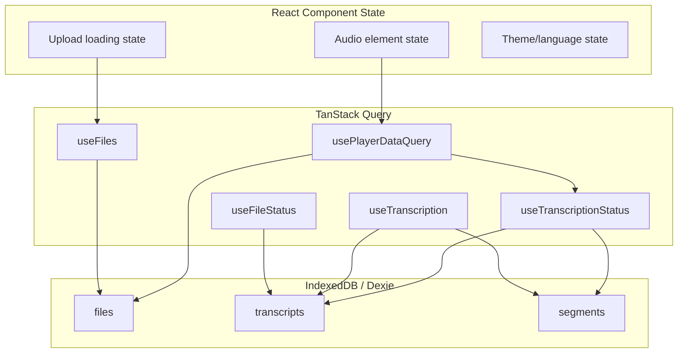
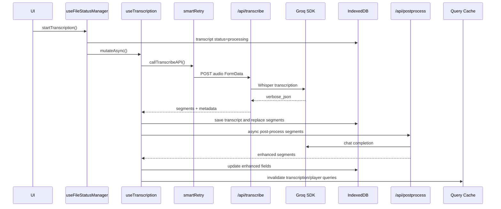

# Architecture

## Overview

Shadowing Learning is an offline-first language learning app for shadowing practice. Users upload audio locally, transcribe it through Groq Whisper, enrich transcript segments through Groq chat completions, and practice with a synchronized audio/subtitle player.

## Tech Stack

| Layer | Technology | Purpose |
|-------|------------|---------|
| Framework | Next.js 16 App Router | Routing, layouts, API routes |
| UI | React 19, shadcn/ui, Radix UI | Component system |
| Language | TypeScript strict mode | Type safety |
| Styling | Tailwind CSS, CSS variables | Design tokens and themes |
| State | TanStack Query v5 | Query cache, mutations, invalidation |
| Storage | Dexie v4 / IndexedDB | Local-first persistence |
| AI | Groq SDK | Whisper transcription and text enhancement |
| Testing | Vitest, React Testing Library | Unit and integration tests |

## Directory Structure

```
src/
  app/
    api/                  # transcribe, postprocess, progress, performance
    player/[fileId]/      # dynamic player route
    settings/             # settings route
    account/              # account route
  components/
    features/
      file/               # FileManager, FileUpload, FileCard, StatsCards
      player/             # PlayerPage, controls, subtitles, fallback states
      settings/           # settings sections and layout
    layout/
      contexts/           # I18n, Theme, TranscriptionLanguage
      providers/          # QueryProvider
    ui/                   # shared primitives and app UI
    transcription/        # transcription loading UI
  hooks/
    api/                  # useTranscription, useApiMonitoring
    db/                   # useFiles
    player/               # usePlayerDataQuery
    ui/                   # audio and keyboard hooks
  lib/
    ai/                   # groq-transcription-utils, server-progress, text-postprocessor
    db/                   # Dexie database and subtitle sync
    utils/                # api response, errors, retry, queue, rate limiting, monitoring
    config/               # routes, URL helpers
  types/
    db/                   # FileRow, TranscriptRow, Segment
    api/                  # API errors
    ui/                   # theme types
    transcription.ts      # transcription/Groq response types
```

## Component Architecture

### Player Components

| Component | Purpose |
|-----------|---------|
| PlayerPage | Main player interface; consumes player data and audio hooks |
| ScrollableSubtitleDisplay | Time-synced subtitle display with current segment highlighting |
| PlayerFooter | Seek, playback, loop, speed, and volume controls |
| PlayerPageLayout | Player page structure |
| PlayerFallbackStates | Loading, missing-file, and error states |
| PlayerErrorBoundary | Error boundary around player route |

### File Management Components

| Component | Purpose |
|-----------|---------|
| FileManager | Upload area, file list, sorting by upload time, delete/play/transcribe actions |
| FileUpload | Drag-and-drop/select file input with format and count validation |
| FileCard | Per-file status and action buttons |
| StatsCards | File statistics overview |

### Layout/UI Components

| Component | Purpose |
|-----------|---------|
| QueryProvider | TanStack Query client and devtools |
| I18nContext | UI translation state |
| ThemeContext | Theme persistence and switching |
| TranscriptionLanguageContext | Learning/native language preferences |
| Navigation | Main navigation |
| ErrorBoundary | Generic React error boundary |
| ThemeToggle / LanguageToggle | UI preferences |

## State Management

### Layers



### Query Keys

```typescript
filesKeys = {
  all: ["files"],
}

transcriptionKeys = {
  all: ["transcription"],
  forFile: (fileId) => ["transcription", "file", fileId],
  progress: (fileId) => ["transcription", "file", fileId, "progress"],
}

playerKeys = {
  all: ["player"],
  file: (fileId) => ["player", "file", fileId],
}

fileStatusKeys = {
  all: ["fileStatus"],
  forFile: (fileId) => ["fileStatus", "file", fileId],
}
```

### Cache Timing

| Scope | staleTime | gcTime |
|-------|-----------|--------|
| QueryProvider default | 15 minutes | 30 minutes |
| useFiles | 0 | 30 minutes |
| useTranscriptionStatus | 1 minute | 10 minutes |
| useFileStatus | 5 minutes | 15 minutes |
| player file query | 10 minutes | 30 minutes |

## Storage Schema

Database version: 3

| Table | Key Fields |
|-------|------------|
| files | id, name, size, type, blob, isChunked, duration, uploadedAt, updatedAt |
| transcripts | id, fileId, status, rawText, language, duration, error, processingTime, createdAt, updatedAt |
| segments | id, transcriptId, start, end, text, normalizedText, translation, romaji, annotations, furigana, wordTimestamps, createdAt, updatedAt |

`TranscriptRow.status` is the source of truth for file transcription state. `FileRow` does not store status.

## API Surface

| Endpoint | Method | Purpose |
|----------|--------|---------|
| /api/transcribe | POST | Validate audio request, rate-limit, call Groq Whisper, return transcript segments |
| /api/postprocess | POST | Normalize text, translate, add annotations/furigana through Groq chat completions |
| /api/progress/[fileId] | GET | Read best-effort in-memory server progress |
| /api/performance | GET | Performance and monitoring data |

## Transcription Architecture



## Player Data Flow

`usePlayerDataQuery(fileId)` loads the audio file and transcript data, creates a Blob object URL, and automatically starts transcription when the file has no transcript.

Object URLs are cached per Blob and revoked when the Blob changes or the player unmounts.

## Error Handling

- API routes return normalized success/error envelopes through `apiSuccess` and `apiError`.
- `smartRetry` handles retryable transcription errors with exponential backoff and jitter.
- Abort errors are not retried.
- `handleTranscriptionError` maps technical failures to user-facing toast messages.
- Player and app-level error boundaries prevent cascading render failures.

## Environment Variables

Only two application-specific variables are currently used:

| Variable | Required | Used By |
|----------|----------|---------|
| GROQ_API_KEY | Yes | `/api/transcribe`, `/api/postprocess`, text post-processing utilities |
| NEXT_PUBLIC_APP_URL | No | metadata, robots, sitemap; defaults to localhost |

## Performance Notes

- IndexedDB writes use transactions and batch inserts for segments.
- Query invalidation keeps UI synchronized after uploads, status changes, transcription completion, and post-processing completion.
- Audio object URLs are explicitly revoked to avoid browser memory leaks.
- Server progress is best-effort in-memory state and should not be treated as durable progress storage.
