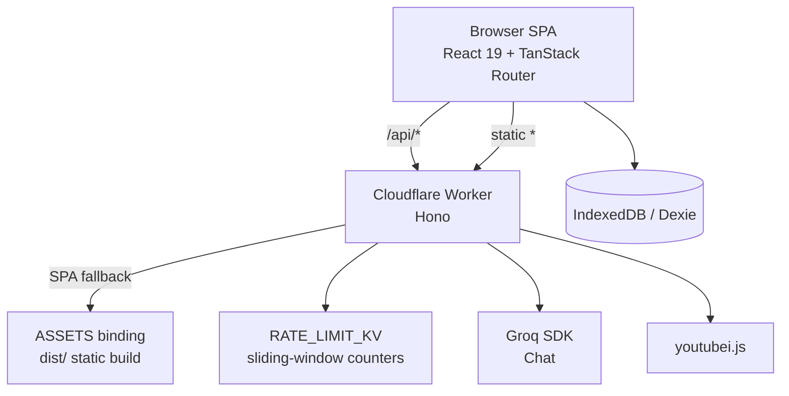
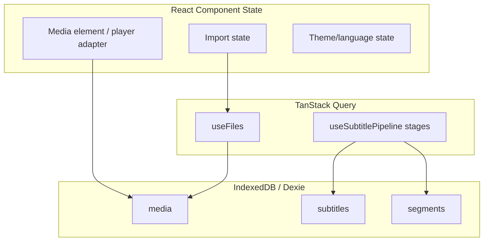

# Architecture

## Overview

Shadowing Learning is an offline-first language learning app for shadowing practice. Users import a YouTube URL, the app fetches the video's caption track, enriches segments through Groq chat completions (translate / annotate / furigana), and provides a synchronized media/subtitle player plus sentence recording.

All user data lives in the browser (IndexedDB via Dexie). **The server is stateless**: a single Cloudflare Worker proxies AI calls, fetches YouTube captions, enforces rate limits, and serves the static SPA.

## Deployment Topology

A single Cloudflare Worker (`worker/index.ts`, Hono) handles **both** the API and static asset delivery. `/api/*` runs Hono route handlers; every other path falls back to the `ASSETS` binding with single-page-application not-found handling.


```mermaid
graph TB
    Browser["Browser SPA<br/>React 19 + TanStack Router"]
    Worker["Cloudflare Worker<br/>Hono"]
    Assets["ASSETS binding<br/>dist/ static build"]
    KV["RATE_LIMIT_KV<br/>sliding-window counters"]
    Groq["Groq SDK<br/>Chat"]
    YT["youtubei.js"]
    IDB[("IndexedDB / Dexie")]

    Browser -->|"/api/*"| Worker
    Browser -->|"static *"| Worker
    Worker -->|SPA fallback| Assets
    Worker --> KV
    Worker --> Groq
    Worker --> YT
    Browser --> IDB
```

Deploy with `wrangler deploy` (runs `vite build` → `dist/`, then uploads the Worker + assets). There is no separate origin server.

Locally the same split applies but nothing builds implicitly: `dist/` is gitignored and `wrangler dev` only *serves* it. Run `bun run build` once, then `bun run dev` (Worker on :8787) alongside `bun run dev:client` (Vite HMR on :3000, proxying `/api` to :8787) and develop against :3000.

## Tech Stack

| Layer | Technology | Purpose |
|-------|------------|---------|
| Build / runtime | Bun + Vite 8 | Build the SPA into `dist/` |
| Edge runtime | Cloudflare Workers + Hono 4 (`nodejs_compat`) | API handlers + static asset delivery |
| Frontend | React 19 + TanStack Router (file-based) | Client-side routing (a plain SPA — **not** TanStack Start) |
| UI | Radix UI, lucide-react | Component system |
| Language | TypeScript strict mode | Type safety |
| Styling | Tailwind CSS v4 (CSS-only), CSS variables | Design tokens and themes |
| Server state | TanStack Query v5 | Query cache, mutations, invalidation |
| Storage | Dexie v5 / IndexedDB | Local-first persistence |
| AI | Groq SDK | Text enhancement (translate / annotate / furigana) |
| YouTube | youtubei.js (Innertube) | Metadata + caption fetch |
| Rate limiting | Cloudflare KV (`RATE_LIMIT_KV`) | Per-IP sliding window |
| Testing | Vitest, React Testing Library, happy-dom | Unit and integration tests |

## Directory Structure

```
worker/                     # Cloudflare Worker (API + asset delivery)
  index.ts                  # Hono app: cors -> rateLimit -> routes -> ASSETS fallback
  routes/
    postprocess.ts          # POST /api/postprocess
    youtube.ts              # POST /api/youtube/{resolve,captions}
  lib/
    groq-client.ts          # Groq SDK factory
    youtube-captions.ts     # timedtext fetch + cue normalization
    api-response.ts         # apiSuccess / apiError envelopes
    types.ts                # Env bindings type
  middleware/
    cors.ts                 # allowed origins (localhost:3000 / :8787)
    rate-limit.ts           # KV-backed per-route sliding window

src/                        # Vite SPA (client)
  routes/                   # __root, index, watch.$mediaId, settings, account
  components/
    features/
      watch/                # WatchPage, WatchControls, SubtitlePanel, CurrentSentence, RecordingBar, MediaViewport
      player/               # source adapters (YouTubeAdapter, iframe-loader, factory), PlayerErrorBoundary
      library/              # online library and YouTube import UI
      settings/             # settings sections and layout
    layout/
      contexts/             # I18n, Theme, TranscriptionLanguage
      providers/            # QueryProvider
    ui/                     # shared primitives + app UI (Navigation, ErrorBoundary, ThemeToggle, PwaRegister, ...)
  hooks/
    media/                  # useSubtitlePipeline, useMediaImport, subtitle-keys
    player/                 # useShadowingPractice, useSentenceRecorder, useSegmentLoop, useSegmentNavigation, usePlayerAdapter, useWatchKeyboard
    db/                     # useFiles
  lib/
    db/db.ts                # Dexie schema (v5) + DBUtils
    player/                 # shadowing-machine, active-segment, active-word
    subtitles/              # chunk-postprocess (chunked translation loop)
    youtube/                # error-messages
    utils/                  # error-handler, logger, utils
    config/                 # routes
    i18n/translations.ts
  types/                    # db, api, ui types
```

## Component Architecture

### Watch / Player Components

| Component | Purpose |
|-----------|---------|
| WatchPage | Main watch interface for a `media` row; drives the subtitle pipeline and player adapter |
| MediaViewport | Renders the YouTube iframe viewport |
| WatchControls | Seek, playback, loop, speed, volume, and shadowing controls |
| SubtitlePanel | Time-synced subtitle list with current-segment highlighting |
| CurrentSentence | Focused current-segment view for shadowing |
| RecordingBar | Sentence recording capture/compare UI |
| PlayerErrorBoundary | Error boundary around the watch route |

### Player Source Adapters (`components/features/player/sources`)

`YouTubeAdapter` (+ `iframe-loader`) drives the YouTube IFrame player and satisfies the adapter interface consumed by `usePlayerAdapter`. (The former `AudioFileAdapter` was removed together with the audio module.)

### Layout / UI Components

| Component | Purpose |
|-----------|---------|
| QueryProvider | TanStack Query client and devtools |
| I18nContext | UI translation state |
| ThemeContext | Theme persistence and switching (default `system`) |
| TranscriptionLanguageContext | Learning/native language preferences |
| Navigation | Main navigation |
| PageErrorBoundary | App-level React error boundary |
| PwaRegister | Service-worker registration |
| ThemeToggle / LanguageToggle | UI preferences |

## State Management

### Layers


```mermaid
graph TB
    subgraph "React Component State"
        A[Media element / player adapter]
        B[Import state]
        C[Theme/language state]
    end

    subgraph "TanStack Query"
        D[useFiles]
        G[useSubtitlePipeline stages]
    end

    subgraph "IndexedDB / Dexie"
        I[media]
        J[subtitles]
        K[segments]
    end

    B --> D
    D --> I
    G --> J
    G --> K
    A --> I
```

### Query Provider Defaults

| Option | Value |
|--------|-------|
| `staleTime` | 15 minutes |
| `gcTime` | 30 minutes |
| `retry` (queries) | up to 3, but never on 4xx |
| `retry` (mutations) | 1 |
| `refetchOnWindowFocus` | false |
| `refetchOnReconnect` | true |

## Storage Schema

Database version: 5 (v3 → v4 unified the media model; v5 dropped the legacy `files`/`transcripts` tables and purged the unreachable audio rows).

**Live tables:**

| Table | Key Fields |
|-------|------------|
| media | id, kind (`'youtube'`), externalId (unique), title, durationSec, channelName, thumbnailUrl, sourceUrl, addedAt, updatedAt |
| subtitles | id, mediaId, source, status, sourceLanguage, targetLanguage, rawText, error, createdAt, updatedAt |
| segments | id, transcriptId (`→ subtitles.id`), start, end, text, normalizedText, translation, romaji, annotations, furigana, wordTimestamps, createdAt, updatedAt |

`subtitles.status` is the source of truth for subtitle processing state. `segments.transcriptId` references `subtitles.id` (field name retained for backwards compatibility).

**Legacy tables (removed in v5):** `files` and `transcripts` existed from v3 through v4 as a read-only recovery window. The v5 migration drops them and purges the unreachable `kind: 'audio'` `media` rows along with their subtitle/segment children.

## API Surface

All API routes run in the Worker under Hono: `cors` on `*`, then `rateLimit` on `/api/*`.

| Endpoint | Method | Rate Limit (per client) | Purpose |
|----------|--------|-------------------------|---------|
| /api/postprocess | POST | 20 req / 1 min | Groq chat (`openai/gpt-oss-120b`): translate, add annotations/furigana |
| /api/youtube/resolve | POST | 20 req / 10 min | Resolve YouTube URL → video metadata + caption-track list via youtubei.js |
| /api/youtube/captions | POST | 20 req / 10 min | Fetch + normalize a caption track; returns `NO_CAPTIONS` (404) if unavailable |
| /api/health | GET | default (60 / 1 min) | `{ status: "ok" }` |

Client identity for rate limiting, in precedence order: the `cf-connecting-ip` header, else the first `x-forwarded-for` entry, else `request.cf.colo`, else a hash of `user-agent` + `accept-language`. Responses carry `X-RateLimit-Limit/Remaining/Reset` and, when limited, `Retry-After` with a `429 RATE_LIMITED` body.

Two verified behavioral warts worth knowing:

- **Unmatched `/api/*` paths return the SPA, not a JSON 404.** The final `app.get("*")` assets fallback catches them, so `GET /api/nope` answers `200 text/html`. API clients cannot rely on a 404 to detect a wrong path.
> **No `/api/youtube/transcribe` route exists.** Cloudflare Workers cannot execute the `yt-dlp` binary, so there is no caption-less audio-download fallback; the client records `error: 'NO_CAPTIONS'` on the subtitle row instead.

## YouTube Import Pipeline

```
YouTube URL → POST /api/youtube/resolve  → video metadata (youtubei.js)
           → client writes `media` row to IndexedDB
           → watch page self-drives via useSubtitlePipeline:
               POST /api/youtube/captions
                 captions available → normalize cues → write `subtitles` + `segments`
                 NO_CAPTIONS        → record subtitle row with error = 'NO_CAPTIONS'
                                      (no server-side audio fallback on Workers)
           → chunked translation loop (subtitles/chunk-postprocess):
               POST /api/postprocess in bounded chunks
               → update `segments` rows incrementally in IndexedDB
           → watch/$mediaId subtitle sync + shadowing practice → user
```

## Player / Shadowing

- `usePlayerAdapter` mounts the YouTube IFrame adapter and exposes a uniform transport (play/pause/seek/rate).
- `lib/player/shadowing-machine.ts` is the shadowing state machine; `active-segment` / `active-word` compute the current segment/word from playback time.
- `useShadowingPractice`, `useSegmentLoop`, and `useSegmentNavigation` drive per-sentence looping and navigation.
- `useSentenceRecorder` captures microphone audio for record-and-compare shadowing.
- `useWatchKeyboard` binds keyboard shortcuts.

## Error Handling

- API routes return normalized success/error envelopes via `apiSuccess` / `apiError`.
- Player and app-level error boundaries prevent cascading render failures.

## Environment Variables & Bindings

| Name | Kind | Required | Used By |
|------|------|----------|---------|
| GROQ_API_KEY | Worker secret | Yes | `/api/postprocess` |
| RATE_LIMIT_KV | KV namespace binding | **Yes (bound)** | `rate-limit` middleware; still no-ops in code if unbound, but removing it exposes `/api/postprocess` as a free proxy to our Groq quota |
| ASSETS | Assets binding (`dist/`) | Yes | SPA fallback in `worker/index.ts` |

Set the secret with `wrangler secret put GROQ_API_KEY`. For local dev, copy [`.dev.vars.example`](../.dev.vars.example) to `.dev.vars` and fill in the key; `.dev.vars` is gitignored. The `RATE_LIMIT_KV` binding is present, so rate limiting is active. It is a **matched pair with the client's chunk retry**: the client posts one request per chunk and the limiter allows 20/min, so the retry/backoff in `subtitles/chunk-postprocess.ts` is what keeps long videos from being truncated.

## Performance Notes

- IndexedDB writes use transactions and batch inserts for segments.
- Query invalidation keeps UI synchronized after imports, pipeline stage changes, and post-processing completion.
- Rate-limit state is best-effort KV (eventually consistent across colos); it is a cost guard, not a hard transactional limit.
