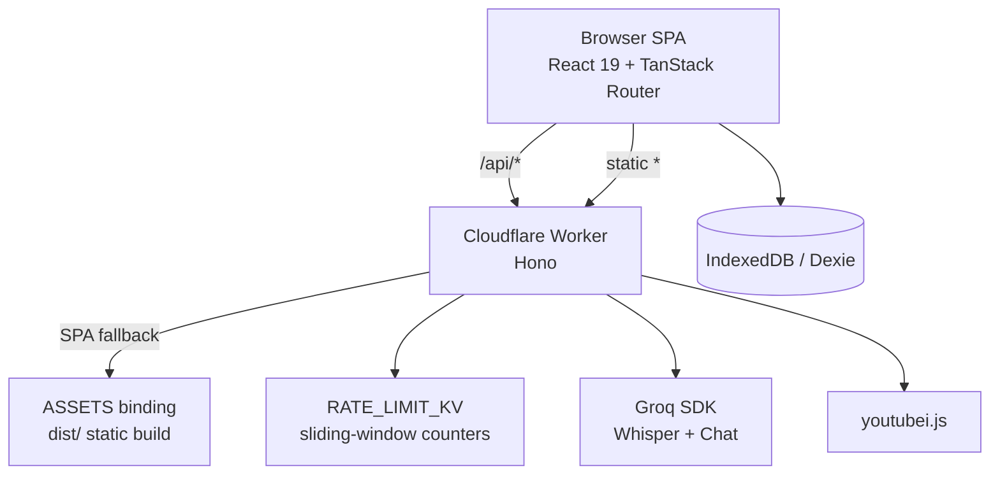
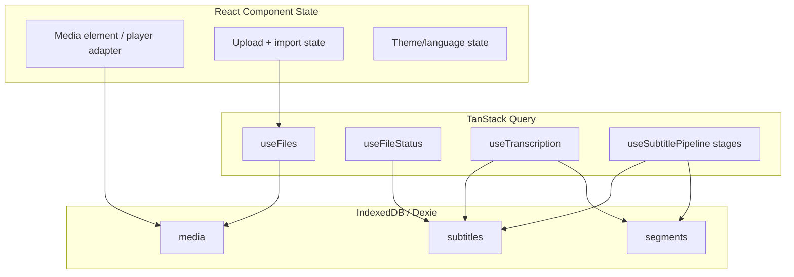
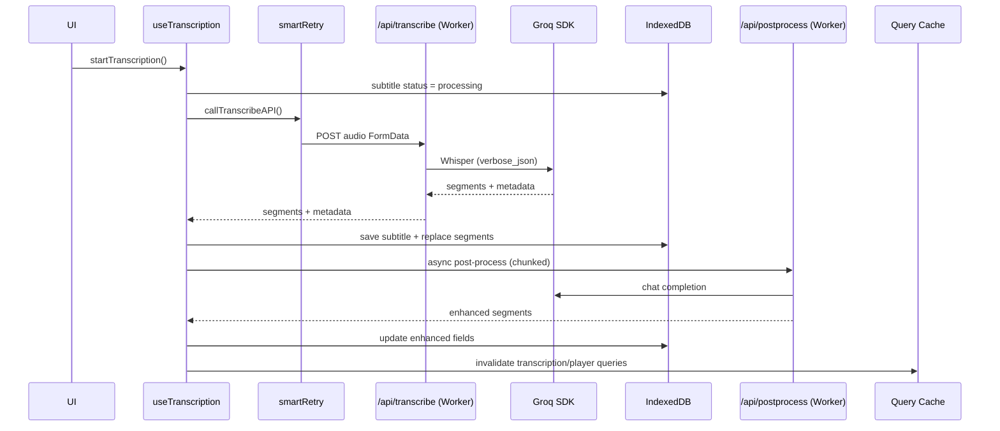

# Architecture

## Overview

Shadowing Learning is an offline-first language learning app for shadowing practice. Users import audio locally or by YouTube URL, transcribe it through Groq Whisper, enrich transcript segments through Groq chat completions (normalize / translate / annotate / furigana), and practice with a synchronized media/subtitle player plus sentence recording.

All user data lives in the browser (IndexedDB via Dexie). **The server is stateless**: a single Cloudflare Worker proxies AI calls, fetches YouTube captions, enforces rate limits, and serves the static SPA.

## Deployment Topology

A single Cloudflare Worker (`worker/index.ts`, Hono) handles **both** the API and static asset delivery. `/api/*` runs Hono route handlers; every other path falls back to the `ASSETS` binding with single-page-application not-found handling.


```mermaid
graph TB
    Browser["Browser SPA<br/>React 19 + TanStack Router"]
    Worker["Cloudflare Worker<br/>Hono"]
    Assets["ASSETS binding<br/>dist/ static build"]
    KV["RATE_LIMIT_KV<br/>sliding-window counters"]
    Groq["Groq SDK<br/>Whisper + Chat"]
    YT["youtubei.js"]
    IDB[("IndexedDB / Dexie")]

    Browser -->|"/api/*"| Worker
    Browser -->|"static *"| Worker
    Worker -->|SPA fallback| Assets
    Worker --> KV
    Worker --> Groq
    Worker --> YT
    Browser --> IDB
```

Deploy with `wrangler deploy` (runs `vite build` → `dist/`, then uploads the Worker + assets). There is no separate origin server.

## Tech Stack

| Layer | Technology | Purpose |
|-------|------------|---------|
| Build / runtime | Bun + Vite 8 | Build the SPA into `dist/` |
| Edge runtime | Cloudflare Workers + Hono 4 (`nodejs_compat`) | API handlers + static asset delivery |
| Frontend | React 19 + TanStack Router (file-based) | Client-side routing (a plain SPA — **not** TanStack Start) |
| UI | Radix UI, lucide-react | Component system |
| Language | TypeScript strict mode | Type safety |
| Styling | Tailwind CSS v4 (CSS-only), CSS variables | Design tokens and themes |
| Server state | TanStack Query v5 | Query cache, mutations, invalidation |
| Storage | Dexie v4 / IndexedDB | Local-first persistence |
| AI | Groq SDK | Whisper transcription and text enhancement |
| YouTube | youtubei.js (Innertube) | Metadata + caption fetch |
| Rate limiting | Cloudflare KV (`RATE_LIMIT_KV`) | Per-IP sliding window |
| Testing | Vitest, React Testing Library, happy-dom | Unit and integration tests |

## Directory Structure

```
worker/                     # Cloudflare Worker (API + asset delivery)
  index.ts                  # Hono app: cors -> rateLimit -> routes -> ASSETS fallback
  routes/
    transcribe.ts           # POST /api/transcribe
    postprocess.ts          # POST /api/postprocess
    youtube.ts              # POST /api/youtube/{resolve,captions}
  lib/
    groq-whisper.ts         # audio validation + Whisper call
    groq-client.ts          # Groq SDK factory
    youtube-captions.ts     # timedtext fetch + cue normalization
    api-response.ts         # apiSuccess / apiError envelopes
    types.ts                # Env bindings type
  middleware/
    cors.ts                 # allowed origins (localhost:3000 / :8787)
    rate-limit.ts           # KV-backed per-route sliding window

src/                        # Vite SPA (client)
  routes/                   # __root, index, watch.$mediaId, me, settings, account
  components/
    features/
      watch/                # WatchPage, WatchControls, SubtitlePanel, CurrentSentence, RecordingBar, MediaViewport
      player/               # source adapters (YouTubeAdapter, AudioFileAdapter, iframe-loader, factory), PlayerErrorBoundary
      library/              # MyAudioPage and file library UI
      file/                 # upload / file management UI
      settings/             # settings sections and layout
    layout/
      contexts/             # I18n, Theme, TranscriptionLanguage
      providers/            # QueryProvider
    ui/                     # shared primitives + app UI (Navigation, ErrorBoundary, ThemeToggle, PwaRegister, ...)
  hooks/
    api/                    # useTranscription
    media/                  # useSubtitlePipeline, useMediaImport, subtitle-keys
    player/                 # useShadowingPractice, useSentenceRecorder, useSegmentLoop, useSegmentNavigation, usePlayerAdapter, useWatchKeyboard
    db/                     # useFiles
    useFileStatus.ts
  lib/
    ai/                     # groq-whisper, groq-transcription-utils, groq-request-wrapper (client-side helpers)
    db/db.ts                # Dexie schema (v4) + DBUtils
    player/                 # shadowing-machine, active-segment, active-word
    subtitles/              # chunk-postprocess (chunked translation loop)
    youtube/                # innertube, normalize, track-select, url, error-messages (ytdlp.ts is legacy — see below)
    utils/                  # error-handler, monitoring-service, retry-utils, file-status-manager, global-limits (legacy), rate-limiter (legacy client copy), web-vitals
    security/               # csp-nonce
    config/                 # routes
    i18n/translations.ts
  types/                    # db, api, ui, transcription types
```

## Component Architecture

### Watch / Player Components

| Component | Purpose |
|-----------|---------|
| WatchPage | Main watch interface for a `media` row; drives the subtitle pipeline and player adapter |
| MediaViewport | Renders the active media source (audio element or YouTube iframe) |
| WatchControls | Seek, playback, loop, speed, volume, and shadowing controls |
| SubtitlePanel | Time-synced subtitle list with current-segment highlighting |
| CurrentSentence | Focused current-segment view for shadowing |
| RecordingBar | Sentence recording capture/compare UI |
| PlayerErrorBoundary | Error boundary around the watch route |

### Player Source Adapters (`components/features/player/sources`)

A `factory` picks a source adapter by media kind. `AudioFileAdapter` plays a local Blob; `YouTubeAdapter` (+ `iframe-loader`) drives the YouTube IFrame player. Both satisfy a shared adapter interface consumed by `usePlayerAdapter`.

### Layout / UI Components

| Component | Purpose |
|-----------|---------|
| QueryProvider | TanStack Query client and devtools |
| I18nContext | UI translation state |
| ThemeContext | Theme persistence and switching (default `system`) |
| TranscriptionLanguageContext | Learning/native language preferences |
| Navigation | Main navigation |
| PageErrorBoundary | App-level React error boundary |
| PwaRegister | Service-worker registration |
| ThemeToggle / LanguageToggle | UI preferences |

## State Management

### Layers


```mermaid
graph TB
    subgraph "React Component State"
        A[Media element / player adapter]
        B[Upload + import state]
        C[Theme/language state]
    end

    subgraph "TanStack Query"
        D[useFiles]
        E[useFileStatus]
        F[useTranscription]
        G[useSubtitlePipeline stages]
    end

    subgraph "IndexedDB / Dexie"
        I[media]
        J[subtitles]
        K[segments]
    end

    B --> D
    D --> I
    E --> J
    F --> J
    F --> K
    G --> J
    G --> K
    A --> I
```

### Query Provider Defaults

| Option | Value |
|--------|-------|
| `staleTime` | 15 minutes |
| `gcTime` | 30 minutes |
| `retry` (queries) | up to 3, but never on 4xx |
| `retry` (mutations) | 1 |
| `refetchOnWindowFocus` | false |
| `refetchOnReconnect` | true |

## Storage Schema

Database version: 4 (two-phase migration from v3).

**Live tables:**

| Table | Key Fields |
|-------|------------|
| media | id, kind (`'audio'`\|`'youtube'`), externalId (unique), title, durationSec, blob, fileName, fileSize, mimeType, addedAt, updatedAt |
| subtitles | id, mediaId, source, status, sourceLanguage, targetLanguage, rawText, error, createdAt, updatedAt |
| segments | id, transcriptId (`→ subtitles.id`), start, end, text, normalizedText, translation, romaji, annotations, furigana, wordTimestamps, createdAt, updatedAt |

`subtitles.status` is the source of truth for subtitle processing state. `segments.transcriptId` references `subtitles.id` (field name retained for backwards compatibility).

**Backup tables (v4, read-only — to be removed in v5):**

| Table | Notes |
|-------|-------|
| files | Preserved verbatim from v3 |
| transcripts | Preserved verbatim from v3 |

## API Surface

All API routes run in the Worker under Hono: `cors` on `*`, then `rateLimit` on `/api/*`.

| Endpoint | Method | Rate Limit (per client) | Purpose |
|----------|--------|-------------------------|---------|
| /api/transcribe | POST | 10 req / 1 min | Validate audio, call Groq Whisper, return verbose transcription (`text`, `language`, `duration`, `segments`) |
| /api/postprocess | POST | 20 req / 1 min | Groq chat (`openai/gpt-oss-120b`): normalize, translate, add annotations/furigana |
| /api/youtube/resolve | POST | 20 req / 10 min | Resolve YouTube URL → video metadata + caption-track list via youtubei.js |
| /api/youtube/captions | POST | 20 req / 10 min | Fetch + normalize a caption track; returns `NO_CAPTIONS` (404) if unavailable |
| /api/health | GET | default (60 / 1 min) | `{ status: "ok" }` |

Client identity for rate limiting: `cf.colo` if present, else `cf-connecting-ip` / `x-forwarded-for`, else a hash of `user-agent` + `accept-language`. Responses carry `X-RateLimit-Limit/Remaining/Reset` and, when limited, `Retry-After` with a `429 RATE_LIMITED` body.

> **No `/api/youtube/transcribe` in the Worker.** Cloudflare Workers cannot execute the `yt-dlp` binary, so the no-caption audio-download fallback was dropped in the Worker migration. `rate-limit.ts` in the Worker does **not** list it; a stale entry survives in the legacy client `src/lib/utils/rate-limiter.ts`.

## Transcription Architecture


```mermaid
sequenceDiagram
    participant UI
    participant Mut as useTranscription
    participant Retry as smartRetry
    participant API as /api/transcribe (Worker)
    participant Groq as Groq SDK
    participant DB as IndexedDB
    participant Post as /api/postprocess (Worker)
    participant Query as Query Cache

    UI->>Mut: startTranscription()
    Mut->>DB: subtitle status = processing
    Mut->>Retry: callTranscribeAPI()
    Retry->>API: POST audio FormData
    API->>Groq: Whisper (verbose_json)
    Groq-->>API: segments + metadata
    API-->>Mut: segments + metadata
    Mut->>DB: save subtitle + replace segments
    Mut->>Post: async post-process (chunked)
    Post->>Groq: chat completion
    Post-->>Mut: enhanced segments
    Mut->>DB: update enhanced fields
    Mut->>Query: invalidate transcription/player queries
```

## YouTube Import Pipeline

```
YouTube URL → POST /api/youtube/resolve  → video metadata (youtubei.js)
           → client writes `media` row to IndexedDB
           → watch page self-drives via useSubtitlePipeline:
               POST /api/youtube/captions
                 captions available → normalize cues → write `subtitles` + `segments`
                 NO_CAPTIONS        → record subtitle row with error = 'NO_CAPTIONS'
                                      (no server-side audio fallback on Workers)
           → chunked translation loop (subtitles/chunk-postprocess):
               POST /api/postprocess in bounded chunks
               → update `segments` rows incrementally in IndexedDB
           → watch/$mediaId subtitle sync + shadowing practice → user
```

## Player / Shadowing

- `usePlayerAdapter` selects a source adapter (audio Blob or YouTube IFrame) and exposes a uniform transport (play/pause/seek/rate).
- `lib/player/shadowing-machine.ts` is the shadowing state machine; `active-segment` / `active-word` compute the current segment/word from playback time.
- `useShadowingPractice`, `useSegmentLoop`, and `useSegmentNavigation` drive per-sentence looping and navigation.
- `useSentenceRecorder` captures microphone audio for record-and-compare shadowing.
- `useWatchKeyboard` binds keyboard shortcuts.
- Audio object URLs are created per Blob and revoked when the Blob changes or the player unmounts.

## Error Handling

- API routes return normalized success/error envelopes via `apiSuccess` / `apiError`.
- `smartRetry` retries retryable transcription errors with exponential backoff + jitter; abort errors are not retried; 4xx are not retried at the Query layer.
- `handleTranscriptionError` maps technical failures to user-facing toast messages.
- Player and app-level error boundaries prevent cascading render failures.

## Environment Variables & Bindings

| Name | Kind | Required | Used By |
|------|------|----------|---------|
| GROQ_API_KEY | Worker secret | Yes | `/api/transcribe`, `/api/postprocess` |
| RATE_LIMIT_KV | KV namespace binding | Yes | `rate-limit` middleware |
| ASSETS | Assets binding (`dist/`) | Yes | SPA fallback in `worker/index.ts` |
| VITE_APP_URL | Worker var + client env | No | Client app URL (`VITE_`-prefixed); defaults to `http://localhost:3000` |

Set the secret with `wrangler secret put GROQ_API_KEY`; the KV namespace id is in `wrangler.jsonc`.

## Performance Notes

- IndexedDB writes use transactions and batch inserts for segments.
- Query invalidation keeps UI synchronized after uploads, status changes, transcription completion, and post-processing completion.
- Audio object URLs are explicitly revoked to avoid browser memory leaks.
- Rate-limit state is best-effort KV (eventually consistent across colos); it is a cost guard, not a hard transactional limit.

## Legacy / Dead Artifacts

The Worker migration left some pre-migration code and infra in the tree that no longer runs in production. Remove when convenient:

- `Dockerfile`, `docker-compose.yml`, `docs/DOKPLOY.md` — target a self-hosted TanStack Start server (`dist/server/server.js`) and bundle `yt-dlp`. The current build produces a Vite SPA served by the Worker; the Docker `CMD` no longer exists.
- `src/lib/youtube/ytdlp.ts` and `src/lib/utils/global-limits.ts` — server-side yt-dlp + concurrency/quota guards for the removed audio fallback; not imported by the Worker.
- `src/lib/utils/rate-limiter.ts` — a client-side copy of the old rate-limit table, still listing `/api/youtube/transcribe`; the authoritative limiter is `worker/middleware/rate-limit.ts`.
