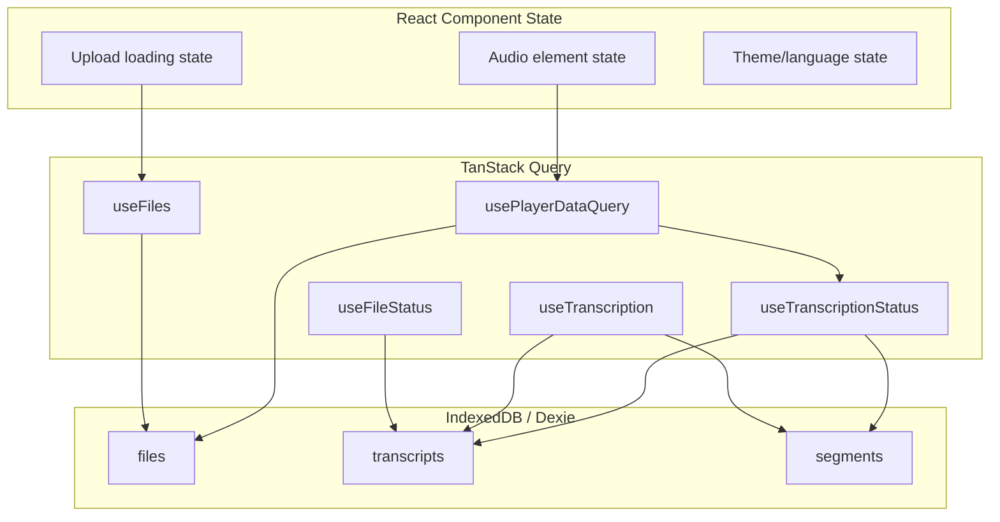
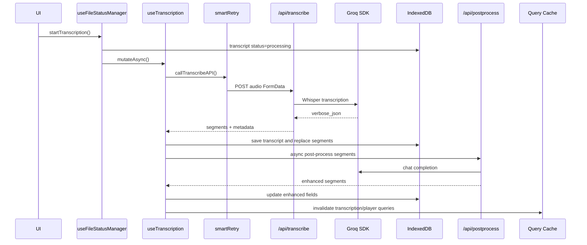

# Architecture

## Overview

Shadowing Learning is an offline-first language learning app for shadowing practice. Users upload audio locally, transcribe it through Groq Whisper, enrich transcript segments through Groq chat completions, and practice with a synchronized audio/subtitle player.

## Tech Stack

| Layer | Technology | Purpose |
|-------|------------|---------|
| Framework | Vite 8 + TanStack Start / TanStack Router | File-based routing, layouts, API route handlers |
| UI | React 19, Radix UI, lucide-react | Component system |
| Language | TypeScript strict mode | Type safety |
| Styling | Tailwind CSS v4 (CSS-only), CSS variables | Design tokens and themes |
| State | TanStack Query v5 | Query cache, mutations, invalidation |
| Storage | Dexie v4 / IndexedDB | Local-first persistence |
| AI | Groq SDK | Whisper transcription and text enhancement |
| YouTube | youtubei.js + yt-dlp | Caption fetch and audio download |
| Testing | Vitest, React Testing Library, happy-dom | Unit and integration tests |

## Directory Structure

```
src/
  routes/
    api/                  # transcribe, postprocess, health, performance, youtube/
      youtube/            # resolve, captions, transcribe
    watch.$mediaId.tsx    # watch/player route
    settings.tsx          # settings route
    account.tsx           # account route
  components/
    features/
      file/               # FileManager, FileUpload, FileCard, StatsCards
      player/             # PlayerPage, controls, subtitles, fallback states
      settings/           # settings sections and layout
    layout/
      contexts/           # I18n, Theme, TranscriptionLanguage
      providers/          # QueryProvider
    ui/                   # shared primitives and app UI
    transcription/        # transcription loading UI
  hooks/
    api/                  # useTranscription, useApiMonitoring
    db/                   # useFiles
    player/               # usePlayerDataQuery
    ui/                   # audio and keyboard hooks
  lib/
    ai/                   # groq-transcription-utils, server-progress, text-postprocessor
    db/                   # Dexie database and subtitle sync
    utils/                # api response, errors, retry, queue, rate limiting, monitoring
    config/               # routes, URL helpers
  types/
    db/                   # FileRow, TranscriptRow, Segment
    api/                  # API errors
    ui/                   # theme types
    transcription.ts      # transcription/Groq response types
```

## Component Architecture

### Player Components

| Component | Purpose |
|-----------|---------|
| PlayerPage | Main player interface; consumes player data and audio hooks |
| ScrollableSubtitleDisplay | Time-synced subtitle display with current segment highlighting |
| PlayerFooter | Seek, playback, loop, speed, and volume controls |
| PlayerPageLayout | Player page structure |
| PlayerFallbackStates | Loading, missing-file, and error states |
| PlayerErrorBoundary | Error boundary around player route |

### File Management Components

| Component | Purpose |
|-----------|---------|
| FileManager | Upload area, file list, sorting by upload time, delete/play/transcribe actions |
| FileUpload | Drag-and-drop/select file input with format and count validation |
| FileCard | Per-file status and action buttons |
| StatsCards | File statistics overview |

### Layout/UI Components

| Component | Purpose |
|-----------|---------|
| QueryProvider | TanStack Query client and devtools |
| I18nContext | UI translation state |
| ThemeContext | Theme persistence and switching |
| TranscriptionLanguageContext | Learning/native language preferences |
| Navigation | Main navigation |
| ErrorBoundary | Generic React error boundary |
| ThemeToggle / LanguageToggle | UI preferences |

## State Management

### Layers


```mermaid
graph TB
    subgraph "React Component State"
        A[Audio element state]
        B[Upload loading state]
        C[Theme/language state]
    end

    subgraph "TanStack Query"
        D[useFiles]
        E[useFileStatus]
        F[useTranscription]
        G[useTranscriptionStatus]
        H[usePlayerDataQuery]
    end

    subgraph "IndexedDB / Dexie"
        I[files]
        J[transcripts]
        K[segments]
    end

    B --> D
    D --> I
    E --> J
    F --> J
    F --> K
    G --> J
    G --> K
    H --> I
    H --> G
    A --> H
```

### Query Keys

```typescript
filesKeys = {
  all: ["files"],
}

transcriptionKeys = {
  all: ["transcription"],
  forFile: (fileId) => ["transcription", "file", fileId],
  progress: (fileId) => ["transcription", "file", fileId, "progress"],
}

playerKeys = {
  all: ["player"],
  file: (fileId) => ["player", "file", fileId],
}

fileStatusKeys = {
  all: ["fileStatus"],
  forFile: (fileId) => ["fileStatus", "file", fileId],
}
```

### Cache Timing

| Scope | staleTime | gcTime |
|-------|-----------|--------|
| QueryProvider default | 15 minutes | 30 minutes |
| useFiles | 0 | 30 minutes |
| useTranscriptionStatus | 1 minute | 10 minutes |
| useFileStatus | 5 minutes | 15 minutes |
| player file query | 10 minutes | 30 minutes |

## Storage Schema

Database version: 4 (two-phase migration)

**Live tables:**

| Table | Key Fields |
|-------|------------|
| media | id, kind (`'audio'`\|`'youtube'`), externalId, title, durationSec, blob, fileName, fileSize, mimeType, addedAt, updatedAt |
| subtitles | id, mediaId, source, status, sourceLanguage, targetLanguage, rawText, error, createdAt, updatedAt |
| segments | id, transcriptId (`→ subtitles.id`), start, end, text, normalizedText, translation, romaji, annotations, furigana, wordTimestamps, createdAt, updatedAt |

`SubtitleRow.status` is the source of truth for subtitle processing state. `segments.transcriptId` references `subtitles.id` (field name retained for backwards compatibility).

**Backup tables (v4, read-only — to be removed in v5):**

| Table | Notes |
|-------|-------|
| files | Preserved from v3; v4 migration copied all rows to `media` |
| transcripts | Preserved from v3; v4 migration copied all rows to `subtitles` |

## API Surface

| Endpoint | Method | Rate Limit | Purpose |
|----------|--------|------------|---------|
| /api/transcribe | POST | per-IP sliding window | Validate audio (≤25 MB), call Groq Whisper, return `TranscriptionSegment[]` |
| /api/postprocess | POST | 20 req / 1 min per-IP | Normalize text, translate, add annotations/furigana via Groq chat completions |
| /api/health | GET | — | Liveness probe (used by Dokploy) |
| /api/performance | POST | token-gated | Web Vitals ingestion |
| /api/youtube/resolve | POST | 20 req / 10 min per-IP | Resolve YouTube URL → video metadata via youtubei.js |
| /api/youtube/captions | POST | 20 req / 10 min per-IP | Fetch + normalize YouTube caption track; returns `NO_CAPTIONS` if unavailable |
| /api/youtube/transcribe | POST | 4 req / hr per-IP + concurrency 1 + 24/UTC-day global quota | No-caption fallback: yt-dlp downloads audio → Groq Whisper transcription |

## Transcription Architecture


```mermaid
sequenceDiagram
    participant UI
    participant Status as useFileStatusManager
    participant Mut as useTranscription
    participant Retry as smartRetry
    participant API as /api/transcribe
    participant Groq as Groq SDK
    participant DB as IndexedDB
    participant Post as /api/postprocess
    participant Query as Query Cache

    UI->>Status: startTranscription()
    Status->>DB: transcript status=processing
    Status->>Mut: mutateAsync()
    Mut->>Retry: callTranscribeAPI()
    Retry->>API: POST audio FormData
    API->>Groq: Whisper transcription
    Groq-->>API: verbose_json
    API-->>Mut: segments + metadata
    Mut->>DB: save transcript and replace segments
    Mut->>Post: async post-process segments
    Post->>Groq: chat completion
    Post-->>Mut: enhanced segments
    Mut->>DB: update enhanced fields
    Mut->>Query: invalidate transcription/player queries
```

## YouTube Import Pipeline

```
YouTube URL → POST /api/youtube/resolve  → video metadata (youtubei.js)
           → client writes `media` row to IndexedDB
           → watch page self-drives via useSubtitlePipeline:
               POST /api/youtube/captions       → captions available?
                 YES → normalize cues → write `subtitles` + `segments`
                 NO  → POST /api/youtube/transcribe (yt-dlp + Groq Whisper)
                     → write `subtitles` + `segments`
           → chunked translation loop:
               POST /api/postprocess in ≤100-segment / ≤10k-char chunks
               → update `segments` rows incrementally in IndexedDB
           → watch/$mediaId subtitle sync → user
```

`yt-dlp` must be installed in the runtime environment: bundled into the Docker image; locally run `brew install yt-dlp`.

## Player Data Flow

`usePlayerDataQuery(fileId)` loads the audio file and transcript data, creates a Blob object URL, and automatically starts transcription when the file has no transcript.

Object URLs are cached per Blob and revoked when the Blob changes or the player unmounts.

## Error Handling

- API routes return normalized success/error envelopes through `apiSuccess` and `apiError`.
- `smartRetry` handles retryable transcription errors with exponential backoff and jitter.
- Abort errors are not retried.
- `handleTranscriptionError` maps technical failures to user-facing toast messages.
- Player and app-level error boundaries prevent cascading render failures.

## Environment Variables

| Variable | Required | Used By |
|----------|----------|---------|
| GROQ_API_KEY | Yes | `/api/transcribe`, `/api/postprocess`, `/api/youtube/transcribe`, text post-processing utilities |
| VITE_APP_URL | No | Client-side app URL (must be `VITE_`-prefixed); defaults to `http://localhost:3000` |
| PERFORMANCE_ADMIN_TOKEN | No | Gates `/api/performance` ingestion |

## Performance Notes

- IndexedDB writes use transactions and batch inserts for segments.
- Query invalidation keeps UI synchronized after uploads, status changes, transcription completion, and post-processing completion.
- Audio object URLs are explicitly revoked to avoid browser memory leaks.
- Server progress is best-effort in-memory state and should not be treated as durable progress storage.
