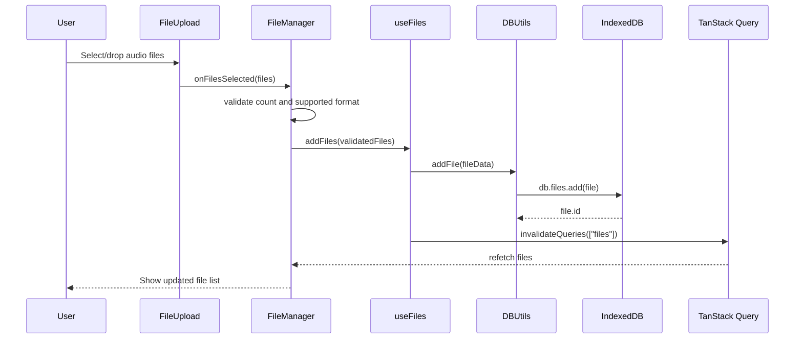
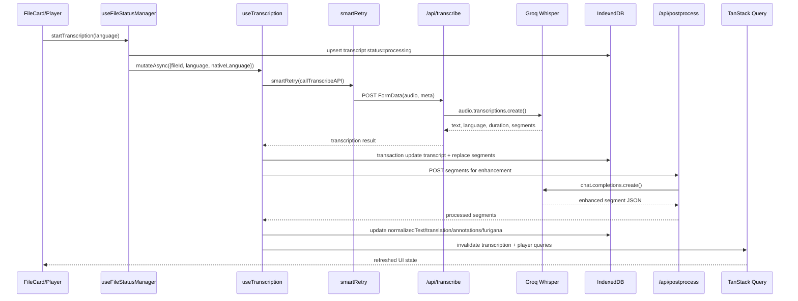
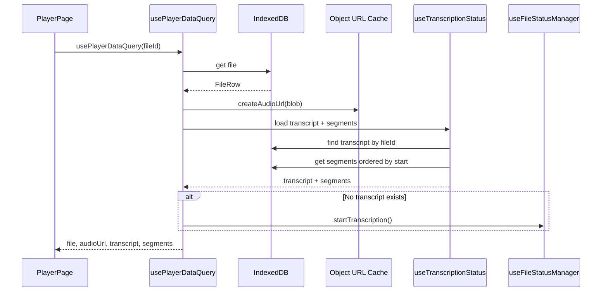

# Data Flow Documentation

## Overview

Shadowing Learning is an offline-first language learning application. Audio files, transcripts, and subtitle segments are stored locally in IndexedDB. External network calls are limited to Groq-backed transcription and text post-processing API routes.

**Data Layer Stack:**
- **Dexie**: IndexedDB wrapper for local persistence
- **TanStack Query**: Client-side query cache, mutations, invalidation, and synchronization
- **Next.js API Routes**: Server-side Groq SDK integration
- **Groq SDK**: Whisper transcription and chat-based text enhancement

---

## Database Schema

Database version: 3

### files table

Stores uploaded audio metadata and binary data.

| Field | Type | Description |
|-------|------|-------------|
| id | number | Auto-increment primary key |
| name | string | Original filename |
| size | number | File size in bytes |
| type | string | MIME type |
| blob | Blob | Binary audio data |
| isChunked | boolean | Reserved flag for chunked storage |
| duration | number | Optional audio duration |
| uploadedAt | Date | Upload timestamp |
| updatedAt | Date | Last modification timestamp |

**Indexes:** `name`, `size`, `type`, `uploadedAt`, `updatedAt`, `[name+type]`

### transcripts table

Tracks transcription status and metadata. `TranscriptRow.status` is the single source of truth for file transcription state.

| Field | Type | Description |
|-------|------|-------------|
| id | number | Auto-increment primary key |
| fileId | number | Foreign key to files table |
| status | string | pending, processing, completed, failed |
| rawText | string | Full transcribed text |
| language | string | Detected or selected transcription language |
| duration | number | Audio duration returned by transcription |
| error | string | Last transcription error |
| processingTime | number | Processing time in milliseconds |
| createdAt | Date | Creation timestamp |
| updatedAt | Date | Last update timestamp |

**Indexes:** `fileId`, `status`, `language`, `createdAt`, `updatedAt`

### segments table

Stores time-coded transcript segments and enhanced learning data.

| Field | Type | Description |
|-------|------|-------------|
| id | number | Auto-increment primary key |
| transcriptId | number | Foreign key to transcripts table |
| start | number | Segment start time in seconds |
| end | number | Segment end time in seconds |
| text | string | Original transcribed text |
| wordTimestamps | WordTimestamp[] | Per-word timing data |
| normalizedText | string | Cleaned/normalized text |
| translation | string | Translated text |
| annotations | string[] | Learning annotations |
| furigana | string | Japanese reading aid |
| createdAt | Date | Creation timestamp |
| updatedAt | Date | Last update timestamp |

**Indexes:** `transcriptId`, `start`, `end`, `text`, `[transcriptId+start]`, `[transcriptId+end]`

---

## Audio Upload Flow

Path: `FileUpload` -> `FileManager.handleFilesSelected` -> `useFiles.addFiles` -> `DBUtils.addFile` -> `db.files`



### Validation Rules

- Accepted formats: MP3, WAV, M4A, OGG, FLAC and matching audio MIME types
- Maximum file count: 5 files by default, passed to `FileUpload` as `maxFiles`
- Upload progress is not simulated; the UI shows a loading state while files are written to IndexedDB

---

## Transcription Flow

### Triggers

- Manual: `FileCard` Transcribe/Retry button -> `useFileStatusManager.startTranscription`
- Automatic: `usePlayerDataQuery` starts transcription when the player opens a file with no transcript

### Process

1. Client reads the audio Blob from IndexedDB.
2. Client sends `POST /api/transcribe?fileId=<id>&language=<code>` with `FormData(audio, meta)`.
3. Server validates input, checks rate limits, and calls Groq Whisper.
4. Server returns full text, language, duration, and time-coded segments.
5. Client saves the transcript and segments in one IndexedDB transaction.
6. Client starts `/api/postprocess` asynchronously for normalization, translation, annotations, and furigana.
7. Post-processing updates matching segment rows.
8. Query invalidation refreshes `transcriptionKeys.forFile(fileId)` and `playerKeys.file(fileId)` so UI updates immediately.



### Error Handling

- `smartRetry` classifies network, rate limit, temporary server, file, authentication, timeout, and unknown errors.
- Abort errors are re-thrown immediately and are not retried.
- Non-recoverable file/authentication errors abort without retry.
- User-facing errors are shown through `handleTranscriptionError` and Sonner toasts.

---

## Player Data Loading

### usePlayerDataQuery Hook

Accepts `fileId` and returns:

```typescript
interface PlayerData {
  file: FileRow | null;
  segments: Segment[];
  transcript: TranscriptRow | null;
  audioUrl: string | null;
  loading: boolean;
  error: string | null;
  retry: () => void;
}
```

### Loading Sequence

1. Load `FileRow` from `db.files`.
2. Create an audio object URL from `file.blob` and cache it by Blob.
3. Load `TranscriptRow` and ordered `Segment[]` via `useTranscriptionStatus(fileId)`.
4. If no transcript exists and the file loaded successfully, trigger `startTranscription()` once.
5. Revoke the object URL when the Blob changes or the component unmounts.



### Player Rendering

- **With segments**: Render `ScrollableSubtitleDisplay` with synced subtitles.
- **Without segments while transcription is starting**: The hook starts transcription automatically; UI may briefly show an empty state until status updates.
- **File load error**: Render player error fallback.

---

## TanStack Query Keys

```typescript
export const filesKeys = {
  all: ["files"] as const,
};

export const transcriptionKeys = {
  all: ["transcription"] as const,
  forFile: (fileId: number) => [...transcriptionKeys.all, "file", fileId] as const,
  progress: (fileId: number) => [...transcriptionKeys.forFile(fileId), "progress"] as const,
};

export const playerKeys = {
  all: ["player"] as const,
  file: (fileId: number) => [...playerKeys.all, "file", fileId] as const,
};

export const fileStatusKeys = {
  all: ["fileStatus"] as const,
  forFile: (fileId: number) => [...fileStatusKeys.all, "file", fileId] as const,
};
```

### Query Invalidation

- File upload/delete: invalidates `filesKeys.all`
- File status update: invalidates `fileStatusKeys.forFile(fileId)` and `filesKeys.all`
- Transcription complete: invalidates `transcriptionKeys.forFile(fileId)`
- Post-processing complete: invalidates `transcriptionKeys.forFile(fileId)` and `playerKeys.file(fileId)`

### Cache Timing

- Global `QueryProvider`: `staleTime` 15 minutes, `gcTime` 30 minutes
- `useTranscriptionStatus`: `staleTime` 1 minute, `gcTime` 10 minutes
- `useFileStatus`: `staleTime` 5 minutes, `gcTime` 15 minutes
- `useFiles`: `staleTime` 0, `gcTime` 30 minutes
- `useFileQuery` in player: `staleTime` 10 minutes, `gcTime` 30 minutes

---

## Environment Variables

Only these variables are read by the current application code:

```env
GROQ_API_KEY=your_groq_api_key_here
NEXT_PUBLIC_APP_URL=http://localhost:3000
```

- `GROQ_API_KEY`: Required by `/api/transcribe`, `/api/postprocess`, and server-side text post-processing utilities.
- `NEXT_PUBLIC_APP_URL`: Used by metadata, sitemap, and robots generation. Defaults to `http://localhost:3000` when omitted.

---

## Caching and Memory

Audio URLs are cached by Blob using a WeakMap, then explicitly revoked when no longer needed:

```typescript
const audioUrlCache = new WeakMap<Blob, string>();

function createAudioUrl(blob: Blob): string {
  const cachedUrl = audioUrlCache.get(blob);
  if (cachedUrl) return cachedUrl;

  const url = URL.createObjectURL(blob);
  audioUrlCache.set(blob, url);
  return url;
}

function revokeAudioUrl(blob: Blob) {
  const url = audioUrlCache.get(blob);
  if (url) URL.revokeObjectURL(url);
  audioUrlCache.delete(blob);
}
```

WeakMap prevents stale Blob references from being strongly retained by the cache; explicit revocation releases browser object URL resources.
