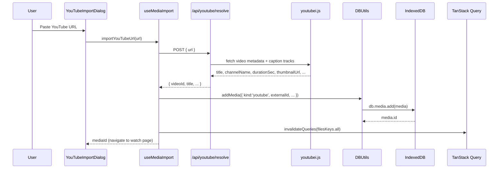
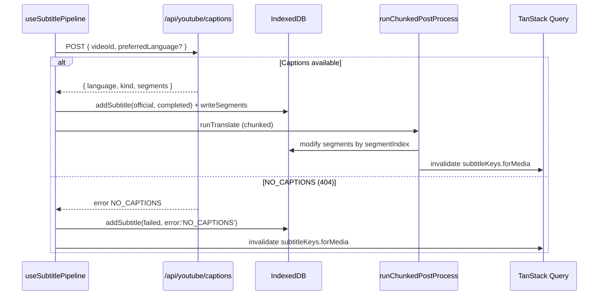

# Data Flow Documentation

## Overview

Shadowing Learning is an offline-first language learning application. Media, subtitles, and time-coded segments are stored locally in IndexedDB. Network calls go to a single Cloudflare Worker (Hono) that fronts Groq for text enhancement, plus YouTube for caption resolution — **except when the user brings their own API key**, in which case the browser calls the AI provider directly and our Worker never sees the request or the key (see [AI-ENGINES.md](./AI-ENGINES.md)).

> The full API surface (request/response shapes, envelopes, error codes) is documented in [ARCHITECTURE.md](./ARCHITECTURE.md). This doc focuses on **data movement**: what is stored, where, and how it flows between IndexedDB, the hooks, and the Worker.

**Data Layer Stack:**

- **Dexie** (library v4; **schema v5**) (`src/lib/db/db.ts`): IndexedDB wrapper for local persistence
- **TanStack Query**: client-side query cache, mutations, and invalidation
- **Cloudflare Worker / Hono** (`worker/index.ts`): the only backend; serves `/api/*` and the built SPA assets
- **Groq**: chat-based enhancement on our quota (`/api/postprocess`, model `openai/gpt-oss-120b`)
- **Provider direct**: the BYOK path — same prompt, no Worker in between

---

## Database Schema

Database version: **5** (`src/lib/db/db.ts`). The live tables are **`media`**, **`subtitles`**, and **`segments`**. `subtitles.status` is the single source of truth for subtitle processing state.

### media table

YouTube media record.

| Field | Type | Description |
|-------|------|-------------|
| id | number | Auto-increment primary key |
| kind | `'youtube'` | Media source |
| title | string | Display title |
| durationSec | number \| null | Duration in seconds |
| addedAt | Date | Creation timestamp |
| updatedAt | Date | Last modification timestamp |
| externalId | string? | YouTube video id |
| channelName | string? | YouTube channel |
| thumbnailUrl | string? | Thumbnail URL |
| sourceUrl | string? | Source URL |

**Indexes:** `++id, kind, &externalId, addedAt, [kind+addedAt]` (`&externalId` is unique).

### subtitles table

Tracks subtitle processing for a media row. `status` is the single source of truth for subtitle state; `postProcessStatus` tracks the optional translation/enhancement pass.

| Field | Type | Description |
|-------|------|-------------|
| id | number | Auto-increment primary key |
| mediaId | number | Foreign key → `media.id` |
| source | `'official'` | YouTube captions (the `whisper` source was removed with the audio module) |
| status | `'pending' \| 'processing' \| 'completed' \| 'failed'` | Source of truth for subtitle state |
| sourceLanguage | string | Detected/selected source language |
| targetLanguage | string \| null | Translation target language |
| postProcessStatus | `'pending' \| 'completed' \| 'failed'`? | Post-processing state |
| postProcessError | string? | Last post-processing error |
| rawText | string? | Full raw text (legacy; no longer written) |
| error | string? | Last subtitle error (e.g. `NO_CAPTIONS`) |
| createdAt | Date | Creation timestamp |
| updatedAt | Date | Last update timestamp |

**Indexes:** `++id, mediaId, status, createdAt`.

### segments table

Time-coded segments and enhanced learning data. `transcriptId` is a foreign key to **`subtitles.id`**; the field name is kept from v3 for backwards compatibility (avoids rewriting the largest table).

| Field | Type | Description |
|-------|------|-------------|
| id | number | Auto-increment primary key |
| transcriptId | number | Foreign key → `subtitles.id` (name kept for backcompat) |
| segmentIndex | number? | Global index within a subtitle, used for chunked write-back |
| start | number | Segment start time in seconds |
| end | number | Segment end time in seconds |
| text | string | Original text |
| normalizedText | string? | Cleaned/normalized text |
| translation | string? | Translated text |
| annotations | string[]? | Learning annotations |
| furigana | string? | Japanese reading aid |
| createdAt | Date | Creation timestamp |
| updatedAt | Date | Last update timestamp |

**Indexes:** `++id, transcriptId, start, end, text, wordTimestamps, normalizedText, translation, annotations, furigana, [transcriptId+start], [transcriptId+end]`.

> The `wordTimestamps` index is **vestigial**. There is no `wordTimestamps` field on `Segment` and
> nothing ever wrote it, so the per-word "karaoke" highlighting that depended on it was unreachable
> code and has been deleted (`lib/player/active-word.ts` + its spec). The index declaration stays in
> the shipped v1–v4 `stores()` blocks because shipped migrations must not be edited, and it is simply
> an empty index. Re-adding word-level highlighting requires a real source of word timings — YouTube
> caption cues we fetch carry no word-level data.

### Legacy v3 tables (dropped in v5)

The v4 schema carried `files` and `transcripts` verbatim from v3 as a read-only recovery window. The **v5 migration drops both tables** and also purges the `media` rows the v4 migration created with `kind: 'audio'` (plus their `subtitles`/`segments` children), which became unreachable once the audio module was removed.

Note for future schema work: in Dexie, omitting a table from `stores()` does **not** delete it — `stores()` merges declarations across versions. A table is only dropped by declaring it explicitly as `null` in a later version:

```ts
this.version(5).stores({ files: null, transcripts: null })
```

### CRUD via `DBUtils`

All persistence goes through `DBUtils` (`src/lib/db/db.ts`). Key entry points:

- **Media:** `addMedia`, `getMedia`, `listMedia`, `findMediaByExternalId`, `deleteMedia`, `cleanupOldMedia`, `getStorageUsage`
- **Subtitles:** `addSubtitle`, `findSubtitleByMediaId`, `updateSubtitleStatus`, `deleteSubtitleWithSegments`
- **Segments:** `addSegment`, `getSegmentsByTranscriptId`, `getSegmentsByTranscriptIdOrdered`, `addSegments` (bulk), `updateSegmentsByTranscriptId`, `findSegmentsByTimeRange`
- **Maintenance:** `clearAll`

**Cascade delete is children-first:**

- `DBUtils.deleteMedia(id)` — within one transaction: delete `segments` (by `transcriptId`) → `subtitles` (by `mediaId`) → `media`.
- `DBUtils.deleteSubtitleWithSegments(subtitleId)` — delete `segments` (by `transcriptId`) → `subtitles`.

Use `addSegments` (bulk) for large segment sets.

---

## YouTube Import Flow

Import only resolves metadata and writes a `media` row; caption fetching and translation are deferred to the watch page pipeline.

Path: `YouTubeImportDialog` → `useMediaImport.importYouTubeUrl` → `POST /api/youtube/resolve` → `DBUtils.addMedia` (kind `'youtube'`) → return `mediaId`


```mermaid
sequenceDiagram
    participant User
    participant Dialog as YouTubeImportDialog
    participant Import as useMediaImport
    participant API as /api/youtube/resolve
    participant YT as youtubei.js
    participant DBUtils
    participant DB as IndexedDB
    participant Query as TanStack Query

    User->>Dialog: Paste YouTube URL
    Dialog->>Import: importYouTubeUrl(url)
    Import->>API: POST { url }
    API->>YT: fetch video metadata + caption tracks
    YT-->>API: title, channelName, durationSec, thumbnailUrl, ...
    API-->>Import: { videoId, title, ... }
    Import->>DBUtils: addMedia({ kind:'youtube', externalId, ... })
    DBUtils->>DB: db.media.add(media)
    DB-->>DBUtils: media.id
    Import->>Query: invalidateQueries(filesKeys.all)
    Import-->>Dialog: mediaId (navigate to watch page)
```

The resolve endpoint returns `LIVE_NOT_SUPPORTED` (422) for live streams and `INVALID_URL` / `EXTRACTOR_FAILED` for unresolvable input. No audio is downloaded at import time.

---

## YouTube Subtitle Pipeline

On the watch page, `useSubtitlePipeline` (`src/hooks/media/useSubtitlePipeline.ts`) self-drives subtitle acquisition for a `media` row. For YouTube media with no subtitle, it runs `runYouTubePipeline`:

1. `POST /api/youtube/captions` with `{ videoId, preferredLanguage? }`.
2. **Success** → the Worker returns `{ language, kind, segments }` (cues fetched and merged). The client writes one `subtitles` row (`source: 'official'`, `status: 'completed'`) and its `segments`, then runs `runTranslate`.
3. **`NO_CAPTIONS` (404)** → the client writes a `subtitles` row with `status: 'failed'` and `error: 'NO_CAPTIONS'`. **There is no audio-download / Whisper fallback** — the Worker runtime cannot shell out to external binaries to fetch audio.
4. **Other failure** → a `failed` subtitle row is written (`error: EXTRACTOR_FAILED` or the thrown message) so the UI can offer retry.


```mermaid
sequenceDiagram
    participant Watch as useSubtitlePipeline
    participant API as /api/youtube/captions
    participant DB as IndexedDB
    participant Post as runChunkedPostProcess
    participant Query as TanStack Query

    Watch->>API: POST { videoId, preferredLanguage? }
    alt Captions available
        API-->>Watch: { language, kind, segments }
        Watch->>DB: addSubtitle(official, completed) + writeSegments
        Watch->>Post: runTranslate (chunked)
        Post->>DB: modify segments by segmentIndex
        Post->>Query: invalidate subtitleKeys.forMedia
    else NO_CAPTIONS (404)
        API-->>Watch: error NO_CAPTIONS
        Watch->>DB: addSubtitle(failed, error:'NO_CAPTIONS')
        Watch->>Query: invalidate subtitleKeys.forMedia
    end
```

### Auto-trigger & recovery contract

`useSubtitlePipeline` decides the next step from the persisted `subtitles` state in a `useEffect`:

- No subtitle for the media → run `runYouTubePipeline`.
- Subtitle exists with `status: 'completed'` but `postProcessStatus: 'pending'` → resume `runTranslate` (cross-session recovery after a closed tab / navigation).

`retry()` / `regenerate()` delete the failed subtitle and its segments via `DBUtils.deleteSubtitleWithSegments`, then invalidate so the effect re-triggers.

---

## Chunked Post-Processing

The YouTube path runs `runChunkedPostProcess` (`src/lib/subtitles/chunk-postprocess.ts`). It only **chunks and writes back** — *who* translates is an injected `PostProcessTransport` (our Worker, or a BYOK direct call). The only cap `/api/postprocess` actually enforces is **`segments.length`**: empty → 400 `NO_SEGMENTS`, more than 100 → 400 `TOO_MANY_SEGMENTS` (`worker/routes/postprocess.ts`). So chunking, serial execution, and per-chunk write-back all happen client-side.

- `MAX_SEGMENTS_PER_CHUNK = 100` mirrors the server's real limit. `MAX_CHARS_PER_CHUNK = 10_000` is **client policy only** — the endpoint validates no character budget, so that number is a self-imposed payload/latency guard, not a server rule.
- Chunks run **serially**. Serial execution avoids concurrency but is not itself a rate-limit guarantee: `/api/postprocess` allows 20 req / 60s while the client posts one request per chunk, so any job over 20 chunks will hit `429`.
- The loop therefore **retries** `RetryableEngineError` (429 / 408 / 5xx) with exponential backoff and jitter, honouring the server's `Retry-After` when present (`RETRY_POLICY` in `src/lib/subtitles/chunk-postprocess.ts`). Non-retryable failures — systemic ones such as an invalid key or a wrong endpoint (`FatalEngineError`) — abort immediately without retrying, and the result carries `completedChunks` so the pipeline can resume. When retries are exhausted the error message says so (`…（已重试 N 次）`).
- Each `onChunkDone` writes results back to `segments` by matching `segmentIndex` (`normalizedText`, `translation`, `annotations`, `furigana` — `src/lib/subtitles/segment-writeback.ts`) and invalidates `subtitleKeys.forMedia`, so enhanced text appears progressively. The whole chunk is written in one transaction (one read + `bulkPut`) rather than one query per segment.
- If `sourceLanguage` and `targetLanguage` share a base language, post-processing is skipped and `postProcessStatus` is set to `completed` directly.
- **Failure semantics differ by kind.** A *systemic* failure (invalid key, wrong endpoint/model, quota exhausted, network/CORS, unexpected response shape) is thrown as `FatalEngineError` and propagates: the chunk is marked failed and `postProcessStatus` becomes `failed`, so a bad BYOK key is surfaced and retrying after fixing it works. A *single-call* failure (5xx, timeout) degrades in place to the original text so one hiccup does not ruin the whole subtitle. A *content-level* failure (model returned non-JSON) also degrades. The distinction is declared by the transport, not guessed by the core — see [AI-ENGINES.md](./AI-ENGINES.md).

---

## Watch Page Data Loading

The watch page reads a single subtitle + its segments through `useSubtitlePipeline`'s internal query (key `subtitleKeys.forMedia(mediaId)`):

1. `DBUtils.findSubtitleByMediaId(mediaId)` → the `subtitles` row (or `null`).
2. If present, `DBUtils.getSegmentsByTranscriptIdOrdered(subtitle.id)` → segments ordered by `start`.
3. The effect then drives acquisition/recovery as described above.

Rendering:

- **With segments**: `SubtitlePanel` renders synced subtitles; the player adapter emits `timeupdate` to drive the active segment.
- **Acquiring**: stage feedback (`fetching-captions` / `translating`) is shown while the pipeline runs.
- **Failed (`NO_CAPTIONS` or error)**: the panel offers retry.

---

## TanStack Query Keys

Live key factories:

```typescript
// src/hooks/db/useFiles.ts
export const filesKeys = {
  all: ["files"] as const,
};

// src/hooks/media/subtitle-keys.ts
export const subtitleKeys = {
  all: ["subtitle"] as const,
  forMedia: (mediaId: number) => [...subtitleKeys.all, "media", mediaId] as const,
};
```

### Query Invalidation

- YouTube import: invalidates `filesKeys.all`
- Media delete (`useFiles.deleteFile`): invalidates `filesKeys.all`
- Post-process chunk done / status update: invalidates `subtitleKeys.forMedia(mediaId)`
- Subtitle pipeline local mutations: invalidates `subtitleKeys.forMedia(mediaId)`

### Cache Timing

- **`QueryProvider`** (`src/components/layout/providers/QueryProvider.tsx`): `staleTime` 15 min, `gcTime` 30 min; queries retry but never on 4xx; mutations retry once; `refetchOnWindowFocus: false`, `refetchOnReconnect: true`.
- **`useFiles`**: `staleTime` 0, `gcTime` 30 min.
- **`useSubtitlePipeline`** subtitle query: `staleTime` 30 s.

---

## Environment Variables

Only these are consumed by the current application code:

- **`GROQ_API_KEY`** — required Worker secret used by `/api/postprocess`. Locally put it in `.dev.vars` (gitignored; copy `.dev.vars.example`); in production set it with `wrangler secret put GROQ_API_KEY`.
- **`RATE_LIMIT_KV`** — KV namespace binding, **present in `wrangler.jsonc`, so rate limiting is live**. The middleware still no-ops when it is unbound (a bare deploy keeps working), but do not remove the binding: `/api/postprocess` spends our own Groq quota. It is a matched pair with the client's chunk retry — see "Chunked Post-Processing" above.

`VITE_APP_URL` and `PERFORMANCE_ADMIN_TOKEN` (and the `.env.example` file that documented them) have been removed — nothing read them after the Worker migration. SEO/meta tags are static in `index.html`; `robots.txt` / `sitemap.xml` are **generated at build time** by the `site-metadata` Vite plugin (`src/lib/config/site-metadata.ts`, unit-tested), which emits no sitemap at all unless `SITE_URL` is set.

---

## Rate Limiting

Rate limiting is a **KV-backed sliding window** (`worker/middleware/rate-limit.ts`), not in-process memory. Every `/api/*` request is classified by route config; the request timestamp list is stored under `rl:<path>:<clientId>` in `RATE_LIMIT_KV` with a TTL.

- **Client id** is derived from request headers in this order: `cf-connecting-ip`, then the first `x-forwarded-for` entry, then `request.cf.colo`, then a hash of `user-agent` + `accept-language`.
- Limits relevant to data flow: `/api/postprocess` 20 req / 60 s; `/api/youtube/resolve` and `/api/youtube/captions` 20 req / 600 s each.
- Responses carry `X-RateLimit-Limit`, `X-RateLimit-Remaining`, `X-RateLimit-Reset`; when limited, `Retry-After` and a `429` body `{ error: { code: "RATE_LIMITED", ... } }` are returned.
