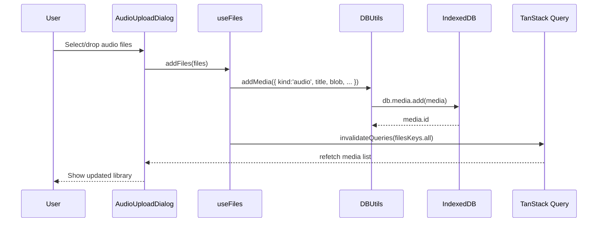
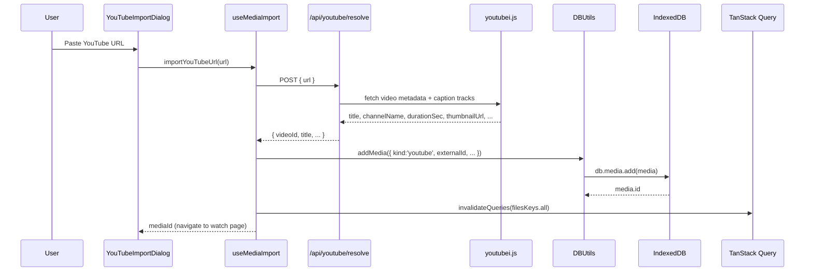
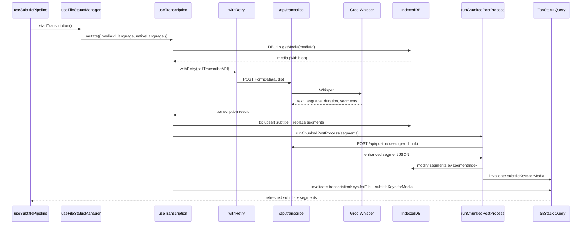
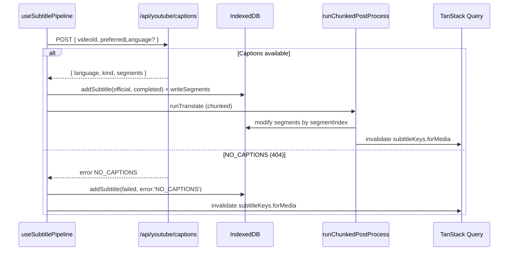

# Data Flow Documentation

## Overview

Shadowing Learning is an offline-first language learning application. Media, subtitles, and time-coded segments are stored locally in IndexedDB. The only network calls are to a single Cloudflare Worker (Hono) that fronts Groq for transcription and text enhancement, plus YouTube for caption resolution.

> The full API surface (request/response shapes, envelopes, error codes) is documented in [ARCHITECTURE.md](./ARCHITECTURE.md). This doc focuses on **data movement**: what is stored, where, and how it flows between IndexedDB, the hooks, and the Worker.

**Data Layer Stack:**

- **Dexie 4** (`src/lib/db/db.ts`): IndexedDB wrapper for local persistence
- **TanStack Query**: client-side query cache, mutations, and invalidation
- **Cloudflare Worker / Hono** (`worker/index.ts`): the only backend; serves `/api/*` and the built SPA assets
- **Groq**: Whisper transcription (`/api/transcribe`) and chat-based enhancement (`/api/postprocess`, model `openai/gpt-oss-120b`)

---

## Database Schema

Database version: **4** (`src/lib/db/db.ts`). The live tables are **`media`**, **`subtitles`**, and **`segments`**. `subtitles.status` is the single source of truth for subtitle processing state.

### media table

Unified media record for both audio files and YouTube videos.

| Field | Type | Description |
|-------|------|-------------|
| id | number | Auto-increment primary key |
| kind | `'audio' \| 'youtube'` | Media source |
| title | string | Display title (filename or video title) |
| durationSec | number \| null | Duration in seconds |
| addedAt | Date | Creation timestamp |
| updatedAt | Date | Last modification timestamp |
| blob | Blob? | Audio binary data (kind `'audio'`) |
| fileName | string? | Original filename (kind `'audio'`) |
| fileSize | number? | File size in bytes (kind `'audio'`) |
| mimeType | string? | MIME type (kind `'audio'`) |
| externalId | string? | YouTube video id (kind `'youtube'`) |
| channelName | string? | YouTube channel (kind `'youtube'`) |
| thumbnailUrl | string? | Thumbnail URL (kind `'youtube'`) |
| sourceUrl | string? | Source URL (kind `'youtube'`) |

**Indexes:** `++id, kind, &externalId, addedAt, [kind+addedAt]` (`&externalId` is unique).

### subtitles table

Tracks subtitle processing for a media row. `status` is the single source of truth for subtitle state; `postProcessStatus` tracks the optional translation/enhancement pass.

| Field | Type | Description |
|-------|------|-------------|
| id | number | Auto-increment primary key |
| mediaId | number | Foreign key → `media.id` |
| source | `'official' \| 'whisper'` | YouTube captions vs. Groq Whisper |
| status | `'pending' \| 'processing' \| 'completed' \| 'failed'` | Source of truth for subtitle state |
| sourceLanguage | string | Detected/selected source language |
| targetLanguage | string \| null | Translation target language |
| postProcessStatus | `'pending' \| 'completed' \| 'failed'`? | Post-processing state |
| postProcessError | string? | Last post-processing error |
| rawText | string? | Full raw text (Whisper path) |
| error | string? | Last subtitle error (e.g. `NO_CAPTIONS`) |
| createdAt | Date | Creation timestamp |
| updatedAt | Date | Last update timestamp |

**Indexes:** `++id, mediaId, status, createdAt`.

### segments table

Time-coded segments and enhanced learning data. `transcriptId` is a foreign key to **`subtitles.id`**; the field name is kept from v3 for backwards compatibility (avoids rewriting the largest table).

| Field | Type | Description |
|-------|------|-------------|
| id | number | Auto-increment primary key |
| transcriptId | number | Foreign key → `subtitles.id` (name kept for backcompat) |
| segmentIndex | number? | Global index within a subtitle, used for chunked write-back |
| start | number | Segment start time in seconds |
| end | number | Segment end time in seconds |
| text | string | Original text |
| normalizedText | string? | Cleaned/normalized text |
| translation | string? | Translated text |
| annotations | string[]? | Learning annotations |
| furigana | string? | Japanese reading aid |
| wordTimestamps | `WordTimestamp[]`? | Per-word timing (`{ word, start, end, confidence? }`) |
| createdAt | Date | Creation timestamp |
| updatedAt | Date | Last update timestamp |

**Indexes:** `++id, transcriptId, start, end, text, wordTimestamps, normalizedText, translation, annotations, furigana, [transcriptId+start], [transcriptId+end]`.

### Legacy v3 tables (read-only recovery window)

`files` and `transcripts` are still declared in the v4 schema **verbatim from v3**. They exist only as a read-only recovery window and are **not** read or written by the live app; they will be dropped in v5. New code must use `media` / `subtitles`.

- `files`: `++id, name, size, type, uploadedAt, [name+type]`
- `transcripts`: `++id, fileId, status, language, createdAt, updatedAt`

### CRUD via `DBUtils`

All persistence goes through `DBUtils` (`src/lib/db/db.ts`). Key entry points:

- **Media:** `addMedia`, `getMedia`, `listMedia`, `findMediaByExternalId`, `deleteMedia`, `cleanupOldMedia`, `getStorageUsage`
- **Subtitles:** `addSubtitle`, `findSubtitleByMediaId`, `updateSubtitleStatus`, `deleteSubtitleWithSegments`
- **Segments:** `addSegment`, `getSegmentsByTranscriptId`, `getSegmentsByTranscriptIdOrdered`, `addSegments` (bulk), `updateSegmentsByTranscriptId`, `findSegmentsByTimeRange`
- **Maintenance:** `clearAll`, `getDatabaseStats`

**Cascade delete is children-first:**

- `DBUtils.deleteMedia(id)` — within one transaction: delete `segments` (by `transcriptId`) → `subtitles` (by `mediaId`) → `media`.
- `DBUtils.deleteSubtitleWithSegments(subtitleId)` — delete `segments` (by `transcriptId`) → `subtitles`.

Use `addSegments` (bulk) for large segment sets.

---

## Audio Upload Flow

Path: `AudioUploadDialog` → `useFiles.addFiles` → `DBUtils.addMedia` → `db.media`


```mermaid
sequenceDiagram
    participant User
    participant Dialog as AudioUploadDialog
    participant useFiles
    participant DBUtils
    participant DB as IndexedDB
    participant Query as TanStack Query

    User->>Dialog: Select/drop audio files
    Dialog->>useFiles: addFiles(files)
    useFiles->>DBUtils: addMedia({ kind:'audio', title, blob, ... })
    DBUtils->>DB: db.media.add(media)
    DB-->>DBUtils: media.id
    useFiles->>Query: invalidateQueries(filesKeys.all)
    Query-->>Dialog: refetch media list
    Dialog-->>User: Show updated library
```

### Validation Rules

- Accepted formats: MP3, WAV, M4A, OGG, FLAC and matching audio MIME types
- Upload entry supports audio only; `kind` is hard-coded to `'audio'` in `useFiles.addFiles`
- The UI shows a loading state while files are written to IndexedDB

---

## YouTube Import Flow

Import only resolves metadata and writes a `media` row; caption fetching and translation are deferred to the watch page pipeline.

Path: `YouTubeImportDialog` → `useMediaImport.importYouTubeUrl` → `POST /api/youtube/resolve` → `DBUtils.addMedia` (kind `'youtube'`) → return `mediaId`


```mermaid
sequenceDiagram
    participant User
    participant Dialog as YouTubeImportDialog
    participant Import as useMediaImport
    participant API as /api/youtube/resolve
    participant YT as youtubei.js
    participant DBUtils
    participant DB as IndexedDB
    participant Query as TanStack Query

    User->>Dialog: Paste YouTube URL
    Dialog->>Import: importYouTubeUrl(url)
    Import->>API: POST { url }
    API->>YT: fetch video metadata + caption tracks
    YT-->>API: title, channelName, durationSec, thumbnailUrl, ...
    API-->>Import: { videoId, title, ... }
    Import->>DBUtils: addMedia({ kind:'youtube', externalId, ... })
    DBUtils->>DB: db.media.add(media)
    DB-->>DBUtils: media.id
    Import->>Query: invalidateQueries(filesKeys.all)
    Import-->>Dialog: mediaId (navigate to watch page)
```

The resolve endpoint returns `LIVE_NOT_SUPPORTED` (422) for live streams and `INVALID_URL` / `EXTRACTOR_FAILED` for unresolvable input. No audio is downloaded at import time.

---

## Audio Transcription Flow

### Triggers

- Automatic (watch page): `useSubtitlePipeline` sees an `audio` media row with no subtitle and calls `useFileStatusManager.startTranscription` (`src/hooks/useFileStatus.ts`).
- Manual retry: the player UI can re-trigger transcription after a failed subtitle is removed.

### Process

1. `useTranscription` (`src/hooks/api/useTranscription.ts`) loads the media blob via `DBUtils.getMedia`.
2. The transcribe call is wrapped in `withRetry` (`src/lib/utils/retry-utils.ts`): up to 3 attempts, exponential backoff (`baseDelay` 1s, `maxDelay` 30s, factor 2). `AbortError`, `401`/`403`, and non-`429` 4xx are not retried.
3. `POST /api/transcribe?language=<code>` sends the blob as `FormData` field `audio` (Worker default language `en`).
4. Worker calls Groq Whisper and returns `{ status, text, language, duration, segments }`.
5. `saveTranscriptionResults` writes the `subtitles` row and its `segments` in **one IndexedDB transaction** (existing subtitle is updated in place; old segments are deleted then re-added in batches of 100).
6. `postProcessTranscription` runs `runChunkedPostProcess` against the new segments, writing each chunk back by `segmentIndex` (see [Chunked Post-Processing](#chunked-post-processing)).
7. Both `transcriptionKeys.forFile(mediaId)` and `subtitleKeys.forMedia(mediaId)` are invalidated so the watch page reflects the new state.


```mermaid
sequenceDiagram
    participant Pipeline as useSubtitlePipeline
    participant Status as useFileStatusManager
    participant Hook as useTranscription
    participant Retry as withRetry
    participant API as /api/transcribe
    participant Groq as Groq Whisper
    participant DB as IndexedDB
    participant Post as runChunkedPostProcess
    participant Query as TanStack Query

    Pipeline->>Status: startTranscription()
    Status->>Hook: mutate({ mediaId, language, nativeLanguage })
    Hook->>DB: DBUtils.getMedia(mediaId)
    DB-->>Hook: media (with blob)
    Hook->>Retry: withRetry(callTranscribeAPI)
    Retry->>API: POST FormData(audio)
    API->>Groq: Whisper
    Groq-->>API: text, language, duration, segments
    API-->>Hook: transcription result
    Hook->>DB: tx: upsert subtitle + replace segments
    Hook->>Post: runChunkedPostProcess(segments)
    Post->>API: POST /api/postprocess (per chunk)
    API-->>Post: enhanced segment JSON
    Post->>DB: modify segments by segmentIndex
    Post->>Query: invalidate subtitleKeys.forMedia
    Hook->>Query: invalidate transcriptionKeys.forFile + subtitleKeys.forMedia
    Query-->>Pipeline: refreshed subtitle + segments
```

### Error Handling

- `withRetry` re-throws `AbortError` immediately; `401`/`403` and non-`429` 4xx abort without retry.
- A failed transcription cleans up partial rows: any `subtitles`/`segments` written for the media are deleted in a transaction before re-throwing.
- User-facing errors are surfaced through `handleTranscriptionError` and Sonner toasts.

---

## YouTube Subtitle Pipeline

On the watch page, `useSubtitlePipeline` (`src/hooks/media/useSubtitlePipeline.ts`) self-drives subtitle acquisition for a `media` row. For YouTube media with no subtitle, it runs `runYouTubePipeline`:

1. `POST /api/youtube/captions` with `{ videoId, preferredLanguage? }`.
2. **Success** → the Worker returns `{ language, kind, segments }` (cues fetched and merged). The client writes one `subtitles` row (`source: 'official'`, `status: 'completed'`) and its `segments`, then runs `runTranslate`.
3. **`NO_CAPTIONS` (404)** → the client writes a `subtitles` row with `status: 'failed'` and `error: 'NO_CAPTIONS'`. **There is no audio-download / Whisper fallback** — the Worker runtime cannot shell out to external binaries to fetch audio.
4. **Other failure** → a `failed` subtitle row is written (`error: EXTRACTOR_FAILED` or the thrown message) so the UI can offer retry.


```mermaid
sequenceDiagram
    participant Watch as useSubtitlePipeline
    participant API as /api/youtube/captions
    participant DB as IndexedDB
    participant Post as runChunkedPostProcess
    participant Query as TanStack Query

    Watch->>API: POST { videoId, preferredLanguage? }
    alt Captions available
        API-->>Watch: { language, kind, segments }
        Watch->>DB: addSubtitle(official, completed) + writeSegments
        Watch->>Post: runTranslate (chunked)
        Post->>DB: modify segments by segmentIndex
        Post->>Query: invalidate subtitleKeys.forMedia
    else NO_CAPTIONS (404)
        API-->>Watch: error NO_CAPTIONS
        Watch->>DB: addSubtitle(failed, error:'NO_CAPTIONS')
        Watch->>Query: invalidate subtitleKeys.forMedia
    end
```

### Auto-trigger & recovery contract

`useSubtitlePipeline` decides the next step from the persisted `subtitles` state in a `useEffect`:

- No subtitle for a `youtube` media → run `runYouTubePipeline`.
- No subtitle for an `audio` media → call `startTranscription` (audio transcription flow).
- Subtitle exists with `status: 'completed'` but `postProcessStatus: 'pending'` → resume `runTranslate` (cross-session recovery after a closed tab / navigation).

`retry()` / `regenerate()` delete the failed subtitle and its segments via `DBUtils.deleteSubtitleWithSegments`, then invalidate so the effect re-triggers.

---

## Chunked Post-Processing

Both the audio and YouTube paths share `runChunkedPostProcess` (`src/lib/subtitles/chunk-postprocess.ts`). The only cap `/api/postprocess` actually enforces is **`segments.length`**: empty → 400 `NO_SEGMENTS`, more than 100 → 400 `TOO_MANY_SEGMENTS` (`worker/routes/postprocess.ts`). So chunking, serial execution, and per-chunk write-back all happen client-side.

- `MAX_SEGMENTS_PER_CHUNK = 100` mirrors the server's real limit. `MAX_CHARS_PER_CHUNK = 10_000` is **client policy only** — the endpoint validates no character budget, so that number is a self-imposed payload/latency guard, not a server rule.
- Chunks run **serially**, which avoids concurrent requests but is *not* a rate-limit guarantee: `/api/postprocess` allows 20 req / 60s, and a job with more than 20 chunks whose responses return quickly can still hit `429`. There is no delay, backoff, or retry in the loop — a non-OK response (including `429`) returns `failed: true` with `postprocess HTTP <status>` and abandons every remaining chunk.
- Each `onChunkDone` writes results back to `segments` by matching `segmentIndex` (`normalizedText`, `translation`, `annotations`, `furigana`) and invalidates `subtitleKeys.forMedia`, so enhanced text appears progressively.
- If `sourceLanguage` and `targetLanguage` share a base language, post-processing is skipped and `postProcessStatus` is set to `completed` directly.

---

## Watch Page Data Loading

The watch page reads a single subtitle + its segments through `useSubtitlePipeline`'s internal query (key `subtitleKeys.forMedia(mediaId)`):

1. `DBUtils.findSubtitleByMediaId(mediaId)` → the `subtitles` row (or `null`).
2. If present, `DBUtils.getSegmentsByTranscriptIdOrdered(subtitle.id)` → segments ordered by `start`.
3. The effect then drives acquisition/recovery as described above.

Rendering:

- **With segments**: `SubtitlePanel` renders synced subtitles; the player adapter emits `timeupdate` to drive the active segment.
- **Acquiring**: stage feedback (`fetching-captions` / `transcribing` / `translating`) is shown while the pipeline runs.
- **Failed (`NO_CAPTIONS` or error)**: the panel offers retry.

---

## TanStack Query Keys

Live key factories:

```typescript
// src/hooks/db/useFiles.ts
export const filesKeys = {
  all: ["files"] as const,
};

// src/hooks/api/useTranscription.ts
export const transcriptionKeys = {
  all: ["transcription"] as const,
  forFile: (fileId: number) => [...transcriptionKeys.all, "file", fileId] as const,
  progress: (fileId: number) => [...transcriptionKeys.forFile(fileId), "progress"] as const,
};

// src/hooks/media/subtitle-keys.ts
export const subtitleKeys = {
  all: ["subtitle"] as const,
  forMedia: (mediaId: number) => [...subtitleKeys.all, "media", mediaId] as const,
};

// src/hooks/useFileStatus.ts
export const fileStatusKeys = {
  all: ["fileStatus"] as const,
  forFile: (fileId: number) => [...fileStatusKeys.all, "file", fileId] as const,
};
```

### Query Invalidation

- Audio upload / YouTube import: invalidates `filesKeys.all`
- Media delete (`useFiles.deleteFile`): invalidates `filesKeys.all`
- `useFileStatusManager` status change: invalidates `fileStatusKeys.forFile(fileId)` and `filesKeys.all`
- Transcription success/error: invalidates `transcriptionKeys.forFile(mediaId)` and `subtitleKeys.forMedia(mediaId)`
- Post-process chunk done / status update: invalidates `subtitleKeys.forMedia(mediaId)` (and `transcriptionKeys.forFile` on status transitions)
- Subtitle pipeline local mutations: invalidates `subtitleKeys.forMedia(mediaId)`

### Cache Timing

- **`QueryProvider`** (`src/components/layout/providers/QueryProvider.tsx`): `staleTime` 15 min, `gcTime` 30 min; queries retry but never on 4xx; mutations retry once; `refetchOnWindowFocus: false`, `refetchOnReconnect: true`.
- **`useTranscriptionStatus`**: `staleTime` 1 min, `gcTime` 10 min.
- **`useFiles`**: `staleTime` 0, `gcTime` 30 min.
- **`useSubtitlePipeline`** subtitle query: `staleTime` 30 s.

---

## Environment Variables

Only these are consumed by the current application code:

- **`GROQ_API_KEY`** — required Worker secret used by `/api/transcribe` and `/api/postprocess`. Locally put it in `.dev.vars` (gitignored); in production set it with `wrangler secret put GROQ_API_KEY`.
- **`RATE_LIMIT_KV`** — a KV namespace binding declared in `wrangler.jsonc`, backing the rate limiter (see below).

Dead / legacy (do not rely on):

- **`VITE_APP_URL`** — present in `wrangler.jsonc` `vars` and `.env.example` but **read by nothing** in `src/`, `worker/`, `index.html`, or `vite.config.ts`.
- **`PERFORMANCE_ADMIN_TOKEN`** — dead; its consumer endpoint was removed.
- SEO/meta tags are static in `index.html`; `robots.txt` and `sitemap.xml` are static files in `public/`. No app-URL environment variable drives metadata, sitemap, or robots generation.

---

## Rate Limiting

Rate limiting is a **KV-backed sliding window** (`worker/middleware/rate-limit.ts`), not in-process memory. Every `/api/*` request is classified by route config; the request timestamp list is stored under `rl:<path>:<clientId>` in `RATE_LIMIT_KV` with a TTL.

- **Client id** is derived from request headers in this order: `cf-connecting-ip`, then the first `x-forwarded-for` entry, then `request.cf.colo`, then a hash of `user-agent` + `accept-language`.
- Limits relevant to data flow: `/api/transcribe` 10 req / 60 s; `/api/postprocess` 20 req / 60 s; `/api/youtube/resolve` and `/api/youtube/captions` 20 req / 600 s each.
- Responses carry `X-RateLimit-Limit`, `X-RateLimit-Remaining`, `X-RateLimit-Reset`; when limited, `Retry-After` and a `429` body `{ error: { code: "RATE_LIMITED", ... } }` are returned. The client's `withRetry` treats `429` as retryable.

---

## Object URL Lifecycle

Audio object URLs are managed per adapter, not via a global cache. `AudioFileAdapter` (`src/components/features/player/sources/AudioFileAdapter.ts`) creates the URL on mount and revokes it on destroy:

```typescript
// mount()
this.objectUrl = URL.createObjectURL(this.media.blob);
audio.src = this.objectUrl;

// destroy()
if (this.objectUrl) {
  URL.revokeObjectURL(this.objectUrl);
  this.objectUrl = null;
}
```

The adapter is selected by `usePlayerAdapter` based on `media.kind` (`AudioFileAdapter` for `'audio'`, `YouTubeAdapter` for `'youtube'`). Revocation on destroy prevents leaked object URLs when navigating away from the watch page.
