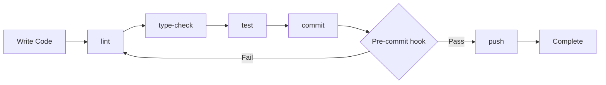

# Development Guide

This guide covers the development setup and workflow for the Shadowing Learning application.

## Prerequisites

Before starting, ensure you have the following installed:

- **Node.js**: >= 20.0.0
- **pnpm**: >= 9.0.0
- **Git**: >= 2.30+

## Setup

1. Clone the repository:
```bash
git clone https://github.com/youming-ai/shadowing-learning.git
cd shadowing-learning
```

2. Install dependencies:
```bash
pnpm install
```

3. Configure environment variables:
```bash
cp .env.example .env.local
```

4. Add your Groq API key to `.env.local`:
```env
GROQ_API_KEY=your_groq_api_key
NEXT_PUBLIC_APP_URL=http://localhost:3000
```

Only `GROQ_API_KEY` is required for transcription and post-processing. `NEXT_PUBLIC_APP_URL` is optional locally and defaults to `http://localhost:3000` when omitted.

5. Start the development server:
```bash
pnpm dev
```

The application will be available at http://localhost:3000

## Available Commands

| Command | Description |
|---------|-------------|
| `pnpm dev` | Start development server (http://localhost:3000) |
| `pnpm build` | Production build |
| `pnpm start` | Start production server |
| `pnpm lint` | Run Biome.js linter |
| `pnpm format` | Format code with Biome.js |
| `pnpm type-check` | TypeScript type checking (tsc --noEmit) |
| `pnpm test` | Run Vitest in watch mode |
| `pnpm test:run` | Run Vitest once |
| `pnpm test:coverage` | Run Vitest with coverage |
| `pnpm clean` | Remove .next and node_modules cache |
| `pnpm prepare` | Setup Husky git hooks |

## Code Quality

### Biome.js Configuration

The project uses Biome.js for linting and formatting with the following configuration:

- **Recommended rules**: Enabled
- **Relaxed rules**:
  - `noUnknownAtRules`: Off (for Tailwind directives)
  - `noExplicitAny`: Off
  - `noDangerouslySetInnerHtml`: Off
  - `useSemanticElements`: Off
- **Warnings**: `noUnusedVariables`
- **Includes**: `src/**/*.ts`, `src/**/*.tsx`, `*.json`, `*.js`, `*.ts`, `*.tsx`, `*.mjs`, `*.cjs`

### Pre-commit Hooks

Husky runs `pnpm lint` before every commit to ensure code quality standards are maintained.

## TypeScript Configuration

- **Strict mode**: Enabled
- **Path alias**: `@/*` maps to `./src/*`
- **Includes**: All `.ts` and `.tsx` files, Next.js type files
- **Excludes**: `node_modules`

## Testing

### Framework

- **Test runner**: Vitest
- **Environment**: jsdom
- **Setup file**: `src/__tests__/setup.ts`
- **Path aliases**: `@/` maps to `src/` in tests

### Test Locations

| Directory | Coverage |
|-----------|----------|
| `src/lib/db/__tests__/` | Database operations (DBUtils CRUD, file/transcript/segment flows) |
| `src/hooks/db/__tests__/` | useFiles hook with TanStack Query provider (load, add, delete, refresh) |
| `src/app/api/transcribe/__tests__/` | Transcription API route (validation, error cases) |
| `src/lib/ai/__tests__/` | Groq transcription utilities (segment mapping, timestamps) |
| `src/lib/utils/__tests__/` | Rate limiter, API response helpers |

## Styling

### Tailwind CSS

- **Content paths**: Pages, components, and app directories
- **Configuration**: Tailwind config in project root

### Design Tokens

- **System**: CSS custom properties in `globals.css`
- **Themes**: 4 available themes
  - Dark (default)
  - Light
  - System
  - High Contrast

### Theme Debugger

Press `Ctrl+Shift+T` to open the theme debugger in development mode.

## Development Cycle



The development workflow follows this cycle:

1. **Write code**: Implement features or fixes
2. **Lint**: Run `pnpm lint` to check code quality
3. **Type-check**: Run `pnpm type-check` to verify TypeScript types
4. **Test**: Run `pnpm test:run` to execute tests
5. **Commit**: Git commit triggers pre-commit hook automatically
6. **Push**: Changes are ready for review
