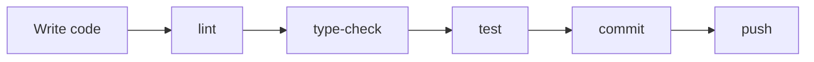

# Development Guide

This guide covers local development setup and workflow for the Shadowing Learning application. For runtime architecture, API surface, and data flow, see [Architecture](./ARCHITECTURE.md).

## Prerequisites

- **Bun** >= 1.2.0 — the project uses Bun exclusively for install, dev, build, test, and deploy.
- A **Groq API key** (used by `/api/transcribe` and `/api/postprocess`).
- A **Cloudflare account** for deployment. `wrangler` is already a devDependency.

## First-run setup

1. Clone and install:
   ```bash
   git clone https://github.com/youming-ai/shadowing-learning.git
   cd shadowing-learning
   bun install
   ```

2. Provide the Groq key for local `wrangler dev` in `.dev.vars` (gitignored):
   ```env
   GROQ_API_KEY=your_groq_api_key
   ```
   `GROQ_API_KEY` is the only required secret. In production set it with `wrangler secret put GROQ_API_KEY`. The `RATE_LIMIT_KV` binding is already declared in `wrangler.jsonc`.

3. Build the client once (see why below):
   ```bash
   bun run build
   ```

## Local development (two terminals)

The Worker (`wrangler dev`) serves the API **and** the static client through its `ASSETS` binding, but it never builds `dist/` — and `dist/` is gitignored. So an initial build is required, and you run two processes side by side:

```bash
# Terminal 1 — Cloudflare Worker (API + dist/ assets), port 8787
bun run dev

# Terminal 2 — Vite SPA with HMR, port 3000, proxies /api → http://localhost:8787
bun run dev:client
```

Develop against **http://localhost:3000**. To see `src/` changes on the Worker's http://localhost:8787, rebuild with `bun run build`.

## Available commands

| Command | Description |
|---------|-------------|
| `bun run dev` | `wrangler dev` — Worker (API + `dist/` assets) on :8787 |
| `bun run dev:client` | Vite dev server with HMR on :3000, proxies `/api` → :8787 |
| `bun run build` | `vite build` — client bundle into `dist/` |
| `bun run deploy` | `bun run build && wrangler deploy` to Cloudflare Workers |
| `bun run lint` | `biome check .` |
| `bun run format` | `biome format . --write` |
| `bun run type-check` | `tsc --noEmit` |
| `bun run test` | `vitest` (watch mode) |
| `bun run test:run` | `vitest run` (one-shot) |
| `bun run test:coverage` | `vitest run --coverage` (v8 reporter) |
| `bun run clean` | Remove build artifacts and caches |

There is no `start` or `preview` script — the SPA has no standalone server; production is a Cloudflare Worker.

## Code quality

Biome (`biome.json`) handles linting and formatting:

- **Linter**: `recommended` rules enabled
- `noUnusedVariables`: error
- `noExplicitAny`, `noDangerouslySetInnerHtml`, `useSemanticElements`: warn
- **Formatter**: single quotes, no semicolons, 2-space indent, 100-column width
- **CSS**: `tailwindDirectives` parsing enabled
- **Includes**: whole repo except `coverage`, `dist`, `.output`, `.next`, `node_modules`, `routeTree.gen.ts`

No pre-commit hooks are configured — run `bun run lint` and `bun run type-check` yourself before committing.

## TypeScript

- **Strict mode** enabled, `noEmit`
- **Path alias**: `~/*` → `./src/*`
- **Types**: `node`, `vitest/globals`, `@testing-library/jest-dom`
- **Includes**: `**/*.ts`, `**/*.tsx`; **excludes**: `node_modules`, `.output`, `dist`, `worker`

## Testing

Tests run on **Vitest** (`vitest.config.ts`) with **happy-dom** and **fake-indexeddb**, set up in `src/__tests__/setup.ts`. The alias `~` resolves to `src/`, matching `tsconfig.json`.

> **Do not run `bun test`.** Every spec imports from `vitest` and there is no `bunfig.toml`, so `bun test` will not pick up the project configuration. Always use the `bun run test*` scripts.

Test locations:

| Directory | Coverage |
|-----------|----------|
| `src/lib/db/__tests__/` | Dexie schema, `DBUtils` CRUD, v4 migration |
| `src/lib/player/__tests__/` | Shadowing state machine, active segment/word |
| `src/lib/subtitles/__tests__/` | Chunked post-processing |
| `src/lib/utils/__tests__/` | Error-handler versioning |
| `src/hooks/db/__tests__/` | `useFiles` with TanStack Query |
| `src/hooks/api/__tests__/` | `useTranscription` |
| `src/hooks/media/__tests__/` | `useMediaImport` |
| `src/components/features/**/__tests__/` | Player source adapters, library grid, file upload |

## Styling

Tailwind v4 is integrated via `@tailwindcss/vite` (no `tailwind.config.*`). Design tokens live in `src/styles/app.css` under `@theme {}`. Themes are selected with `html[data-theme="dark|light|high-contrast"]` (`:root` is dark), plus a `system` option.

## Deployment

```bash
bun run deploy   # = bun run build && wrangler deploy
```

Set the production secret first with `wrangler secret put GROQ_API_KEY`. There is no Docker/Dokploy deployment path: the legacy `Dockerfile`, `docker-compose.yml`, and `docs/DOKPLOY.md` target a server bundle the current build does not produce, and Workers cannot run the `yt-dlp` binary those images bundle.

## Development cycle


```mermaid
flowchart LR
    A[Write code] --> B[lint]
    B --> C[type-check]
    C --> D[test]
    D --> E[commit]
    E --> F[push]
```

1. Implement the feature or fix
2. `bun run lint`
3. `bun run type-check`
4. `bun run test:run`
5. Commit and push
