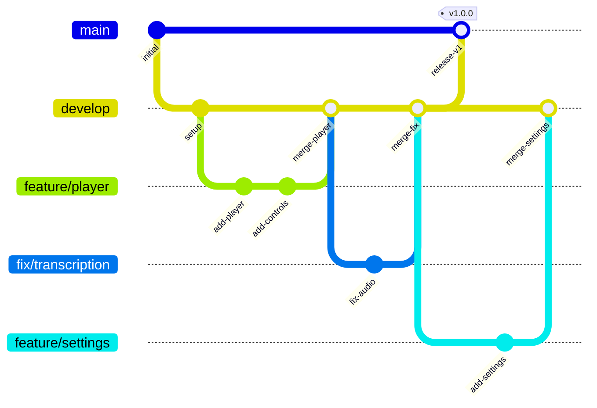
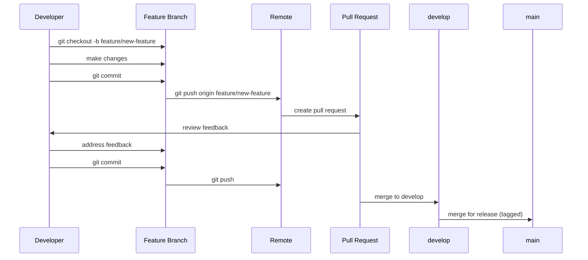

# Git Workflow

This document describes the Git workflow and conventions for the project.

## Branch Strategy

The project uses a two-branch model with feature branches for development.

### Permanent Branches

| Branch | Purpose | Source | Merges To | Protected |
|--------|---------|--------|-----------|-----------|
| main | Production | - | - | Yes (PR only) |
| develop | Integration | main | main | No |

### Feature Branches

| Branch | Purpose | Source | Merges To | Protected |
|--------|---------|--------|-----------|-----------|
| feature/* | New features | develop | develop | No |
| fix/* | Bug fixes | develop | develop | No |
| refactor/* | Code refactoring | develop | develop | No |

### Branch Diagram



## Commit Convention

All commits must follow the Conventional Commits specification.

### Format

```
<type>(<scope>): <description>
```

### Commit Types

| Type | Description |
|------|-------------|
| feat | New feature |
| fix | Bug fix |
| docs | Documentation |
| style | Code formatting (no logic change) |
| refactor | Code refactoring |
| test | Tests |
| chore | Build/tooling changes |

### Examples

```
feat(player): add playback speed control
fix(transcription): handle empty audio file
docs(readme): update installation steps
refactor(hooks): consolidate transcription state
test(api): add transcription endpoint tests
chore(deps): update dependencies
```

## Pre-commit Enforcement

Husky runs automated checks before every commit.

### What Gets Checked

- `pnpm lint` runs Biome.js linting on staged files
- Commits are blocked if lint errors exist
- Fix lint errors before committing

### Bypass (Emergency Only)

```bash
git commit --no-verify
```

Use `--no-verify` only in emergencies. Fix lint issues properly as soon as possible.

## Pull Request Flow

### Standard Flow

1. Create branch from `develop`
2. Implement changes
3. Push branch to remote
4. Create pull request targeting `develop`
5. Address review feedback
6. Merge to `develop`
7. Delete feature branch

### Production Releases

When ready for production:

1. Create PR from `develop` to `main`
2. Review and approve
3. Merge to `main`
4. Tag release version

### PR Flow Diagram



## Code Review Checklist

Before requesting review, ensure:

- [ ] Code follows project conventions
- [ ] TypeScript types are correct (no `any`)
- [ ] Tests added or updated as needed
- [ ] No lint warnings
- [ ] Commit messages follow convention

### Reviewer Responsibilities

- Check code quality and maintainability
- Verify TypeScript type safety
- Confirm test coverage for new code
- Ensure documentation is updated if needed
- Validate commit message format
