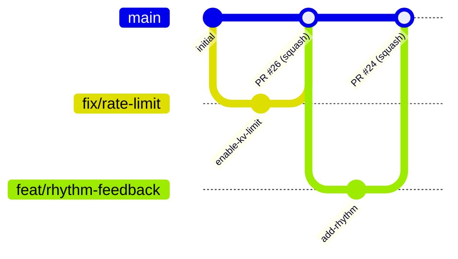

# Git Workflow

This document describes the Git workflow and conventions for the project.

> **这是订正过的一版。** 之前它描述的是「`main` + `develop` 双分支 + Husky pre-commit + pnpm」，
> 但这三样在本仓库**都不存在**：只有一个长期分支 `main`、没有 `.husky/`、包管理器是 Bun。
> 一份与仓库不符的流程文档比没有文档更糟 —— 它会让人以为提交时有一道并不存在的闸门。

## Branch Strategy

**单主干：`main` 是唯一的长期分支，也是部署来源**（`bun run deploy` 从它发布）。
所有改动都从 `main` 切出，以 PR 形式合回 `main`。

| Branch | Purpose | Source | Merges To |
|--------|---------|--------|-----------|
| main | 生产 / 部署 | - | - |
| feature/* | 新功能 | main | main |
| fix/* | 缺陷修复 | main | main |
| refactor/* | 重构（行为不变） | main | main |
| docs/* · chore/* | 文档 / 工具链 | main | main |

合并方式为 **squash merge**（历史形如 `fix(scope): … (#NN)`），因此 `main` 上每个 PR 只留一个提交，
便于回溯与回滚。


```mermaid
gitGraph
    commit id: "initial"
    branch fix/rate-limit
    checkout fix/rate-limit
    commit id: "enable-kv-limit"
    checkout main
    merge fix/rate-limit id: "PR #26 (squash)"
    branch feat/rhythm-feedback
    checkout feat/rhythm-feedback
    commit id: "add-rhythm"
    checkout main
    merge feat/rhythm-feedback id: "PR #24 (squash)"
```

## Commit Convention

All commits must follow the Conventional Commits specification.

### Format

```
<type>(<scope>): <description>
```

### Commit Types

| Type | Description |
|------|-------------|
| feat | New feature |
| fix | Bug fix |
| docs | Documentation |
| style | Code formatting (no logic change) |
| refactor | Code refactoring |
| test | Tests |
| chore | Build/tooling changes |

### Examples

```
feat(player): add playback speed control
fix(transcription): handle empty audio file
docs(readme): update installation steps
refactor(hooks): consolidate transcription state
test(api): add transcription endpoint tests
chore(deps): update dependencies
```

## The Gate: CI, not a commit hook

**本仓库没有任何 commit-time 钩子**（没有 Husky、没有 lint-staged）。真正的闸门是 CI。

[`.github/workflows/ci.yml`](../.github/workflows/ci.yml) 在每次 PR 与 `main` 推送时运行，必须全绿：

| Step | Command |
|------|---------|
| Lint | `bun run lint` |
| Type check | `bun run type-check`（客户端 + Worker 两套 tsconfig） |
| Tests | `bun run test:run` |
| Build | `bun run build` |

推送前请在本地跑这同样四条命令 —— 它们与 CI 一一对应。

不要用 `--no-verify` 之类的绕过手段「解决」失败：它在这里本来就没东西可绕，只说明本地没跑过 CI。
（历史上确实出现过把提交写到 `main` 上、以及「测试通过但测试无效」的情况 —— 见下方 Checklist。）

## Pull Request Flow

1. 从 `main` 切分支（`fix/*`、`feat/*`、`chore/*`…）
2. 实现改动，并补/改测试
3. 本地跑上面四条命令
4. 推送分支，向 `main` 开 PR
5. 处理评审意见
6. squash merge 到 `main`
7. 需要发布时：`bun run deploy`（构建 SPA + 上传 Worker 与 assets）

### Reviewers run automatically — and need triage

仓库接了两个自动评审器（**cubic**、**Codex**），它们会在 PR 上自动留行内评论。
它们**命中率参差**：实测既报出过真实缺陷（含用户可见的），也报出过误报（例如因为 PR 拆分而
声称某个模块不存在）与低价值建议。**逐条复现验证后再改**，不要照单全收 —— 但也不要完全不看。

## Code Review Checklist

Before requesting review, ensure:

- [ ] CI 四条命令本地全绿（lint / type-check / test / build）
- [ ] Code follows project conventions
- [ ] TypeScript types are correct (no `any`)
- [ ] **Tests actually verify the claim** —— 「测试通过」不等于「测试有效」：
      如果实现退化成错误版本而这个用例照样通过，那它就没有守住任何东西
- [ ] No lint warnings
- [ ] Commit messages follow convention
- [ ] 文档与代码一致（本仓库的主要历史问题之一是文档漂移：数据库版本、
      已移除的功能、并不存在的字段）

### Reviewer Responsibilities

- Check code quality and maintainability
- Verify TypeScript type safety
- Confirm test coverage for new code
- Ensure documentation is updated if needed
- Validate commit message format
